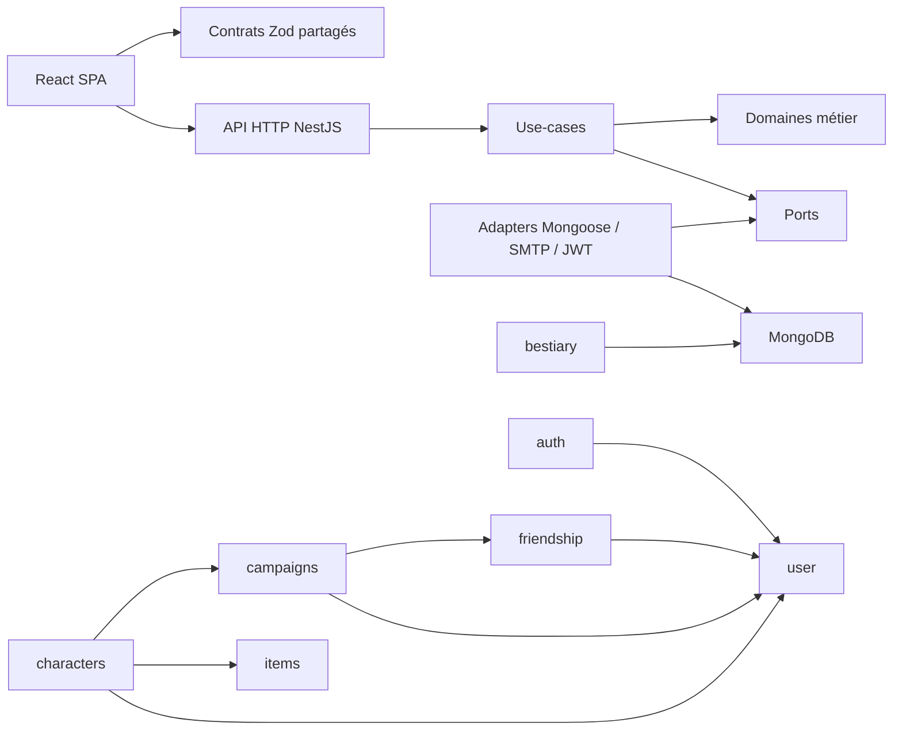

# Transcription locale du fil Codex

Archive générée depuis le journal JSONL local. Elle conserve les messages utilisateur et assistant dans leur ordre original.
Les instructions système, contextes techniques injectés, raisonnements internes et appels d’outils sont volontairement exclus.

- Source locale : `rollout-2026-08-19T18-10-44-01a01aca-0da1-78c2-b549-2287ef693812.jsonl`
- SHA-256 de la source au moment de l’export : `AC10BB5724EBECBC4BCD47FE8ABF7D1E8365B93437B99D4FB5DE2B8859C99703`
- Messages exportés : 77

---

## Message 1 — Utilisateur

_Horodatage local du journal : 08/19/2026 16:10:44_

Je développe actuellement un SaaS qui a déjà été partiellement développé avec Claude Code.

J'ai commencé à coder assez rapidement sans rédiger au préalable de véritables spécifications fonctionnelles et techniques. Je constate maintenant que cette absence de documentation et de règles clairement établies pénalise le développement : certaines décisions peuvent être implicites, l'architecture peut dériver et les agents IA peuvent faire des choix différents au fil des sessions.

Je veux donc arrêter temporairement le développement de nouvelles fonctionnalités afin de construire une **spécification complète et exploitable du système existant et du produit cible**.

## Objectif

Je veux que tu m'accompagnes pour créer progressivement la documentation de référence du projet.

À terme, cette documentation devra être placée directement dans le repository afin que ChatGPT/Codex, Claude Code ou un développeur humain puissent comprendre :

* ce que fait le produit ;
* pourquoi il existe ;
* qui sont ses utilisateurs ;
* quelles fonctionnalités doivent exister ;
* quelles sont les règles métier ;
* comment les différentes fonctionnalités interagissent ;
* quelle architecture technique est utilisée ;
* comment les données sont structurées ;
* quelles API et intégrations existent ;
* quelles contraintes de sécurité doivent être respectées ;
* comment le système doit être testé ;
* quelles décisions techniques ont été prises et pourquoi.

## Situation particulière

Le projet contient déjà du code.

Il est donc essentiel de distinguer trois choses :

1. **L'intention produit** : ce que je veux réellement construire.
2. **L'état actuel** : ce que le code implémente aujourd'hui.
3. **La spécification cible** : le comportement que le système devrait finalement avoir.

Ne considère jamais automatiquement le code existant comme la spécification correcte.

Une fonctionnalité présente dans le code peut être :

* correcte ;
* incomplète ;
* expérimentale ;
* obsolète ;
* mal conçue ;
* ou simplement différente de mon intention initiale.

En cas de contradiction entre mon intention et l'implémentation actuelle, signale-la explicitement au lieu d'inventer une justification.

## Méthode de travail

Je ne veux pas que tu génères immédiatement une énorme spécification à partir de suppositions.

Procédons progressivement.

### Phase 1 — Compréhension du produit

Commence par m'interroger sur :

* l'idée du SaaS ;
* le problème qu'il cherche à résoudre ;
* les utilisateurs ciblés ;
* les principaux cas d'utilisation ;
* le modèle économique envisagé ;
* les fonctionnalités principales ;
* ce qui constitue le MVP ;
* les fonctionnalités envisagées à plus long terme.

Challenge mes réponses lorsque quelque chose semble incohérent, inutilement complexe ou insuffisamment défini.

### Phase 2 — Audit du projet existant

Lorsque je te donnerai accès au repository, analyse son contenu avant de proposer des changements.

Identifie notamment :

* stack technique ;
* structure du repository ;
* frontend ;
* backend ;
* base de données ;
* authentification ;
* autorisations ;
* API ;
* services externes ;
* système de paiement éventuel ;
* stockage ;
* emails/notifications ;
* tâches asynchrones ;
* tests ;
* infrastructure ;
* déploiement ;
* CI/CD ;
* fonctionnalités déjà implémentées.

Produis ensuite une cartographie de l'existant.

Ne modifie pas le code pendant cette phase.

### Phase 3 — Analyse des écarts

Compare :

**INTENTION PRODUIT ↔ SPÉCIFICATION CIBLE ↔ CODE EXISTANT**

Pour chaque différence importante, indique si elle correspond à :

* une fonctionnalité manquante ;
* une fonctionnalité partielle ;
* une dette technique ;
* une incohérence d'architecture ;
* une règle métier ambiguë ;
* une décision à prendre ;
* du code probablement obsolète.

Ne corrige rien automatiquement.

### Phase 4 — Spécifications fonctionnelles

Construisons ensuite les spécifications fonctionnelles.

Pour chaque fonctionnalité importante, je veux idéalement :

* objectif ;
* acteurs concernés ;
* préconditions ;
* scénario nominal ;
* scénarios alternatifs ;
* erreurs possibles ;
* règles métier ;
* permissions ;
* données manipulées ;
* critères d'acceptation ;
* cas limites.

Utilise des User Stories lorsque cela apporte réellement de la clarté.

Exemple :

> En tant que [acteur], je veux [action] afin de [objectif].

Les critères d'acceptation doivent être suffisamment précis pour permettre ensuite d'écrire des tests.

### Phase 5 — Spécifications techniques

Une fois les fonctionnalités suffisamment définies, documentons :

* architecture ;
* frontend ;
* backend ;
* base de données ;
* modèle de données ;
* API ;
* authentification ;
* autorisations ;
* sécurité ;
* stockage ;
* intégrations externes ;
* gestion des erreurs ;
* logs ;
* monitoring ;
* tests ;
* déploiement.

Ne propose pas de changement technologique simplement parce qu'une autre technologie est plus populaire. Toute modification de stack doit répondre à un problème concret.

### Phase 6 — Documentation dans le repository

Je souhaite progressivement obtenir une structure proche de :

```text
docs/
├── PRODUCT.md
├── REQUIREMENTS.md
├── ARCHITECTURE.md
├── DATABASE.md
├── API.md
├── SECURITY.md
├── TESTING.md
└── DECISIONS/
    ├── 001-....md
    └── 002-....md

AGENTS.md
README.md
```

Cette structure pourra évoluer si tu proposes une organisation plus adaptée au projet.

`AGENTS.md` devra notamment donner aux agents IA les règles nécessaires pour travailler correctement sur le repository. Il iexiste des AGENTS.md dans le projet qui redirige vers les CLAUDE.md dans le projet. Il faut aussi prendre en compte les .claude/rules/ du projet pour développer.

## Règles importantes pour la suite du projet

Je veux adopter le principe suivant :

**SPEC → PLAN → CODE → TEST → REVIEW**

et éviter :

**PROMPT → CODE → CORRECTION → NOUVEAU CODE → DÉRIVE**

Avant d'implémenter une fonctionnalité importante, nous devons pouvoir identifier la spécification ou la règle métier correspondante.

Si une information nécessaire manque, ne l'invente pas.

Indique :

> DÉCISION REQUISE

puis explique la question à trancher, les principales possibilités et leurs conséquences.

Distingue également clairement :

* **FAIT** : vérifié dans le code ou explicitement établi ;
* **DÉCISION** : choix que nous avons validé ;
* **HYPOTHÈSE** : élément supposé mais non confirmé ;
* **RECOMMANDATION** : proposition que tu me fais.

Je veux que tu critiques mes décisions lorsqu'elles présentent des problèmes techniques ou produit. Ne valide pas une idée uniquement parce que je la propose.

## Pour commencer

Ne rédige pas encore les spécifications complètes et ne modifie aucun fichier.

Commence uniquement par la **Phase 1 : compréhension du produit**.

Pose-moi les questions nécessaires pour comprendre précisément le SaaS que je souhaite construire.

Lorsque cette vision sera suffisamment claire, nous passerons à l'analyse du repository existant.


---

## Message 2 — Assistant

_Horodatage local du journal : 08/19/2026 16:10:44_

Nous restons strictement en Phase 1 : je n’analyse pas encore le repository et ne modifie aucun fichier. À ce stade, décrivez votre intention produit, même si le code actuel fait autre chose. Lorsque vous mentionnez l’existant, séparez-le clairement de la cible.

Répondez librement, même partiellement. Si un point n’est pas tranché, indiquez simplement « DÉCISION REQUISE ».

## 1. Vision et problème

1. Décrivez le SaaS en une ou deux phrases, comme si vous l’expliquiez à un utilisateur potentiel.

2. Quel problème concret cherche-t-il à résoudre ? Donnez si possible un exemple réel de situation frustrante ou coûteuse.

3. Comment ce problème est-il résolu aujourd’hui sans votre produit : outils concurrents, tableurs, Discord, papier, travail manuel, combinaison de services ?

4. Pourquoi ces solutions sont-elles insuffisantes ? Le problème est-il fréquent et suffisamment important pour justifier un produit dédié ?

5. Quel résultat observable l’utilisateur doit-il obtenir grâce au SaaS ? Par exemple : gagner du temps, mieux organiser une campagne, automatiser une tâche, améliorer l’immersion ou réduire les erreurs.

## 2. Utilisateurs et acteurs

6. Qui est l’utilisateur principal ? Décrivez-le précisément : rôle, expérience, contexte d’utilisation et niveau de maîtrise technique.

7. Quels autres acteurs interagissent avec le produit ? Par exemple : administrateur de la plateforme, propriétaire d’un espace, maître du jeu, joueur, invité, modérateur.

8. Qui crée un compte, qui crée ou possède les ressources, qui invite les autres et qui paie ?

9. Le produit est-il destiné à une utilisation individuelle, à un groupe permanent, à une organisation, ou à plusieurs de ces contextes ?

10. Faut-il cibler en priorité les débutants, les utilisateurs expérimentés, ou les deux ? Si les deux, leurs parcours doivent-ils être différents ?

## 3. Cas d’utilisation

11. Décrivez les trois parcours les plus importants, de leur déclenchement jusqu’au résultat final.

Pour chacun :

- qui réalise l’action ;
- ce qu’il cherche à accomplir ;
- les principales étapes ;
- les autres personnes éventuellement impliquées ;
- le résultat attendu.

12. Parmi ces parcours, lequel constitue la raison principale d’utiliser ou de payer le produit ?

13. Si le produit ne pouvait accomplir qu’une seule chose remarquablement bien, laquelle choisiriez-vous ?

14. À quel moment le produit est-il utilisé : préparation en amont, utilisation en direct pendant une session, suivi après la session, ou en continu ?

15. Plusieurs utilisateurs doivent-ils collaborer en temps réel ? Si oui, que doivent-ils voir ou modifier simultanément ?

## 4. Fonctionnalités et périmètre

16. Quelles fonctionnalités considérez-vous aujourd’hui comme centrales ? Pour chacune, précisez brièvement la valeur apportée, pas seulement son mécanisme.

17. Qu’est-ce qui doit absolument être présent dans le MVP pour que vous puissiez le mettre entre les mains d’un premier utilisateur ?

18. Quelles fonctionnalités sont explicitement exclues du MVP, même si elles semblent utiles ?

19. Quelles fonctionnalités envisagez-vous à plus long terme ? Lesquelles sont certaines, et lesquelles sont seulement des idées à explorer ?

20. Le produit dépend-il d’éléments particuliers tels que :

- génération par IA ;
- contenu officiel ou créé par les utilisateurs ;
- fichiers ou médias ;
- messagerie ou notifications ;
- paiement ou abonnement ;
- marketplace ;
- import ou export ;
- intégrations avec d’autres outils ;
- utilisation mobile ou hors ligne ?

## 5. Domaine métier

21. Le produit est-il spécifiquement lié à Donjons & Dragons, compatible avec plusieurs jeux de rôle, ou conçu comme un outil générique ?

22. Quelles notions métier sont essentielles ? Donnez votre vocabulaire actuel, même s’il n’est pas stabilisé : campagne, aventure, session, personnage, groupe, partie, ressource, document, etc.

23. Existe-t-il une hiérarchie ou un cycle de vie naturel entre ces notions ? Par exemple : une campagne contient des sessions, une session implique des personnages et produit un compte rendu.

24. Certaines informations doivent-elles rester secrètes pour certains acteurs ? Précisez les frontières de visibilité que vous imaginez.

25. Existe-t-il des règles métier que vous considérez déjà comme non négociables ?

## 6. Modèle économique et validation

26. Quel modèle économique envisagez-vous : gratuit, freemium, abonnement individuel, abonnement par groupe, paiement ponctuel ou autre ?

27. Qui est réellement susceptible de payer, et pour quelle valeur suffisamment forte ?

28. Certaines fonctionnalités ou limites doivent-elles dépendre du niveau d’abonnement ?

29. Comment saurez-vous que le MVP fonctionne ? Donnez si possible des critères observables : premiers utilisateurs actifs, campagnes créées, rétention, fréquence d’utilisation, abonnements ou retours qualitatifs.

30. Avez-vous déjà des utilisateurs, testeurs, entretiens, retours ou concurrents de référence qui ont influencé votre vision ?

Enfin, indiquez les éventuelles contraintes déjà connues : date cible, budget, fonctionnement solo ou en équipe, obligations légales, dépendance à des licences de jeu, pays/langues visés, ou choix que vous refusez de remettre en question.

---

## Message 3 — Utilisateur

_Horodatage local du journal : 08/19/2026 16:10:44_

1. Vision et problème
   1. Saas permettant de jouer à Donjon et dragon et d'autres jeu de role avec une extrême simplicité d'utilisation pour la création et l'évolution des personnages dans une campagne, et avoir un interface de combats simple, intuitive et rapide.
   2. Je cherche à résoudre la gestion des personnages d'une campagne difficile à gérer pour des néophytes joueur ou MJ, et penser à toutes les mécaniques de combats qui s'appliquent quand on joue en ligne ou en physique. En ligne c'est assez complexe pour la gestion des combats avec des ennemis et entre alliés avec beaucoup de clic de partout
   3. Il y a les plateformes FoundryVTT et Role20 mais je les trouves très lourdes, trop de fonctionnalités superflue, interface lourde, latence.
   4. Ces solutions sont les seule disponibles sur le marché, on doit faire avec et la prise en main est importante pour pouvoir jouer, avec de grande configuration pour les combats, avec pour certaine des paiements d'abonnements pour des fonctionnalités de bases. Ils ont voulu implémenter tous les aspect du jeu de role sur un support numérique alors que la fiche de personnage, les combats, les jets de dés et la narration du jeu de role sont les fondements du jeu et pas besoin de plus.
   5. Un accès rapide pour faire une session de jeu de role : Voir leur fiche de personnage avec toutes les informations détaillées et faciliter l'évolution au fil des niveaux en visualisant ce qu'on a accès. Avoir un systeme de combat avec une carte 2D, 2,5D ou 3D avec des éléments simples pour faire des combats comme en présentiel avec des figurines pour améliorer l'immersion. Réduire ainsi les erreurs sur les fiches et combats dans la campagne. Avoir un simulateur de jet de dé très ecitant car les joueurs seront en ligne sans avoir des dés physique. Pour le MJ avoir toute sa campagne rédigée à un seul endroit
2. Utilisateurs et acteurs :
   6. L'utilisateur principal sont des joueurs de jeu de role, joueur ou maitre de jeu débutants et/ou qui n'ont pas le temps de maitriser toutes les regles pour leur session hebdomadaire ou mensuelle.
   7. Acteurs : administrateur de la plateforme, maitre du jeu et joueur
   8. Tous les joueurs créés un compte, je possède les ressources. Les joueurs s'invitent entre eux. Pour le paiement DECISION REQUISE, je n'ai pas encore pensée au paiement.
   9. Pour le moment c'est une utilisation individuelle hébergé sur mon ordinateur et les joueurs peuvent se connecter à ma machine via un tunnel cloudflare. Mais j'aimerais la rendre dispo en ligne sous paiement dans un 2e temps.
   10. Les deux, leur parcours doit être identique.
3. Cas d'utilisation
   11. Parcours 1 : un utilisateur décide de créer une campagne, il devient MJ, il invite ses amis qui sont sur la plateforme. Les amis sont notifiés sur l'app et par email qu'ils sont invités. Parcours 2 : Les utilisateurs de la campagne, MJ et joueurs, créent les personnages, peuvent être édité une fois créés et on peut voir la fiche final à consulter. Parcours 3 : Le MJ lance un combat et on a une interface intuitive pour gérer les tours des créatures (monstres gérés par MJ et personnages gérés par chaque joueur) qui doivent jouer et l'utilisations des sorts, capacités et actions à l'instar de baldur gates 3 en visuellement beaucoup plus simplifier. On termine par une fin de combat avec les récompenses de base récupérable et les cachés via jet d'investigation.
   12. Le combat
   13. Le combat, il y a trop de regles complexes issues des fiches de personnages qu'il faut maitriser et une interface hyper agréables et moderne pour générer de la dopamine.
   14. En continu, l'évolution de la fiche de personnage avec les items récupérés au fil de la campagne (donnés via des cartes d'objet comme dans le jeu physique), la montée de niveau du personnage, la création des différents combats rencontrés par les joueurs que le MJ aura anticipé, la réalisation des combats. Rédaction de la campagne mis en forme via du markdown, import de markdown géré.
   15. Oui. Les MJ doivent voir les modifications des fiches de personnages des joueurs. Chaque joueur voit sa propre fiche de personnage de la campagne et pas celles de autres. Voir l'évolution des combats, les jets de ddés de chacun.
4. Fonctionnalités et périmètres.
   16. La création et évolution de la fiche de personnage et la gestion des combats. La fiche du personnage est le support centrale du joueur, il y a beaucoup de règles à penser et c'est l'incarnation du personnage qui provoque une fierté de voir l'évolution de son personnage. Les combats sont aussi l'aspect central du jeu car ce sont des moments immersifs du jdr avec les figurines sur le plateau et les jets de dés. De plus les utilisateurs peuvent avoir envie de juste faire des combats via la plateforme comme un rogue like car c'est une partie la plus prisé des joueurs de faire des combats et de l'optimisation de build de personnage
   17. Création des personnages niveau 1 pour les joueurs ayant rejoint une campagne et utilisation de ces personnages en combat
   18. Ajout de notes de la campagne dans le journal de bord d'un personnage, mise en place de la rédaction de la campagne à lire au joueurs
   19. Ajouter de la musique à la session pour meubler. Ecrire des notes dans le journal de bord des personnages pour se rappeler de ce qu'ils ont fait, entendu ou indices. La rédaction de la campagne par le MJ, ajout de combats animés enrichie visuellement et en effet en 2D, 2,5D, 3D, et pas juste une reproduction simple d'un plateau de figurines sans animation sans contenu riche (juste des pions identifiables, des matériaux comme cube et cylindre pour les obstacle) , incorporation de l'IA comme maitre de jeu pour faire des campagnes sans MJ humains, avec possiblement par voix IA pour jouer avec les joueurs. Un système de vagues de combats. Un salon audio où les joueurs et MJ ont leur voix changé par rapport à leur personnage (accent d'un nain, d'une elfe alors qu'on est un homme, un orc).
   20. Le produit dépend de contenu officiel trouvable en ligne
5. Domaine métier
   21. Je me dis que je couvrirai plus de personne avec une compatibilité de plusieurs jeux de role pour les revenus
   22. campagne, amis, utilisateur, joueur, maitre de jeu, personnage, objet. Je ne suis pas assez calé pour les notions métiers.
   23. La plateforme a des utilisateurs. Les utilisateurs peuvent enregistrer des amis (autre utilisateurs de la plateforme). Les utilisateurs peuvent créer des campagne ou rejoindre des campagnes d'autres utilisateurs amis s'ils ont été invité. Un utilisateur peut être joueur ou maitre de jeu. Un joueur peut créer et éditer un personnage. Un maitre de jeu peut créer et éditer plusieurs personnage et les attribuer à des joueurs. Les personnages font des combats contre des créatures (personnages qui ne sont pas attribuées à des joueurs).
   24. les jets de dés du maitre de jeu doivent être secret des autres joueurs. Les fiches de personnages ne peuvent pas être visible par d'autre joueur de la campagne. Le MJ peut voir toutes les fiches de personnages de tous les joueurs de la campagne.
   25. On ne peut pas voir de campagne de joueur si on est pas invité par des amis. On doit pouvoir changer de MJ dans une campagne.
6. Modèle économique et validation
   26. Aucune idée, il faudra brainstormer là dessus. Le produit étant pour une solution personnelle à la base, il faut le rendre rentable en sachant si je suis juridiquement dans les clous avec l'utilisation affichée de donjon et dragon. Savoir le cout d'un serveur comme sur OVH pour déployer l'app ouvert à tous et comment couvrir mes frais de serveur et la montée charge. Les IA qui seront utilisées plus tard, mais ça sera au prix du token, plus une petite marge pour me rémunérer, mais c'est dans la phase long terme ce dernier point.
   27. Le maitre du jeu et joueur pour faciliter la gestion des personnages et avoir des combats avec une excellente expérience utilisateur. Le RP serait aussi rentabilisé, je pense que les gens aimeraient avoir des voix modifiées par IA
   28. Le nombre de création de campagne, le nombre de joueurs invités, les classes, races disponibles.
   29. Je vais l'utiliser avec une dizaine d'amis qui jouent au jeu de role en ligne et qui sont sur Roll20. Je vais l'utiliser sur ma propre campagne physique maintenant que je suis séparé de mes joueurs en présentiel. J'aurais des retours terrain avant de le déployer sur un serveur avec des couts. J'aurais ainsi une validation du MVP. Après j'aurais la fréquence d'utilisation et abonnements
   30. J'ai mes amis qui ont fait plusieurs campagne sur Roll20 et foundryVTT, les MJ font des conifguration de l'espace à chaque fois, trop compliqué par rapport à du jdr conventionnel en physique. Le systeme de combat est pas le plus intuitif avec les cartes et les token des personnages, ni le plus sexy, ni le plus fluide.
LA date cible ça serait pour mi octobre au moment où je vais reprendre le jeu de role avec mes amis (sachant que du 2 au 27 septembre je ne pourrai pas travailler). Le budget, ce sont juste mes abonnements chatGPT Plus et Claude Pro. Je ferais la campagne sur mon ordinateur via cloudflare pour que ça soit accessible à internet.
Tant que je suis sur ma machine je n'ai pas de contrainte légale, il faudra voir plus tard en le monétisant si juridiquement parlant j'ai les droits avec Donjon et Dragon ou si je dois faire une demande de partenariats. Pour le moment c'est la france qui est visée, mais on verra ensuite pour le portage dans d'autre langue


---

## Message 4 — Assistant

_Horodatage local du journal : 08/19/2026 16:10:44_

La vision produit commence à être nette : un outil de jeu de rôle centré sur la fiche de personnage et le combat, beaucoup plus immédiat qu’un VTT généraliste. En revanche, le MVP reste trop large et plusieurs décisions structurantes doivent être prises avant d’auditer utilement le code.

Je ne consulte pas encore le repository et ne modifie aucun fichier.

## Ce que je considère comme établi

**FAIT — Intention produit**

- Le produit doit réduire la charge cognitive des joueurs et MJ occasionnels.
- Sa proposition de valeur principale est une expérience de combat fluide, moderne et gratifiante.
- La fiche de personnage constitue le second pilier : création guidée, consultation claire et évolution fiable.
- Le premier pilote sera réalisé avec une dizaine d’amis ayant déjà utilisé Roll20 ou Foundry VTT.
- Le MVP doit permettre de créer un personnage de niveau 1 dans une campagne et de l’utiliser au cours d’un combat.
- Le MJ voit les personnages de la campagne ; chaque joueur contrôle son propre personnage.
- Les jets du MJ peuvent être secrets.
- Une campagne doit pouvoir changer de MJ.
- Le pilote sera hébergé sur votre ordinateur et exposé par Cloudflare.
- La cible annoncée est mi-octobre 2026, avec indisponibilité du 2 au 27 septembre.

**HYPOTHÈSE — Positionnement**

> « Le plaisir tactique et visuel d’un combat de jeu de rôle, sans la complexité de configuration d’un VTT complet. »

C’est actuellement une promesse plus différenciante et plus crédible que « une plateforme couvrant tous les aspects du jeu de rôle ».

## Points que je remets en question

### 1. Plusieurs jeux de rôle ne signifient pas automatiquement davantage de revenus

Chaque système introduit ses propres personnages, attributs, dés, actions, sorts, progression et règles de combat. Une compatibilité générique dès le départ pourrait rendre le produit aussi complexe que les outils que vous souhaitez remplacer.

**RECOMMANDATION** — Concevoir le premier produit pour un seul système et une seule version de ses règles. Éviter néanmoins de disperser les règles dans l’interface afin de ne pas interdire une extension future.

### 2. « Penser à toutes les règles » contredit l’objectif de simplicité et la date cible

Un moteur reproduisant intégralement les règles de D&D doit gérer notamment les actions, actions bonus, réactions, déplacements, portée, ligne de vue, couverture, avantage, états, concentration, résistances, immunités, mort, sorts et exceptions propres aux capacités.

Avec environ cinq semaines calendaires disponibles avant mi-octobre, la création guidée de personnages et un moteur de combat complet ne constituent pas un MVP réaliste.

**DÉCISION REQUISE** — Le produit doit-il :

1. faire respecter automatiquement toutes les règles ;
2. automatiser les règles courantes tout en laissant le MJ corriger ou arbitrer ;
3. fournir principalement des outils manuels et des calculs indicatifs ?

**RECOMMANDATION** — Option 2 : assistance forte, transparence des calculs et possibilité d’arbitrage par le MJ.

### 3. Le combat « façon Baldur’s Gate 3 » crée une attente très élevée

Baldur’s Gate 3 implique une visualisation riche, des animations, une forte automatisation et un grand nombre d’interactions contextuelles. Même « visuellement simplifié », cette référence peut masquer plusieurs années de travail.

**RECOMMANDATION** — Pour le pilote : plateau 2D, pions lisibles, déplacements rapides, initiative, actions accessibles et jets visuellement satisfaisants. La 2,5D, la 3D et les animations enrichies doivent rester hors MVP.

### 4. Débutants et experts ne bénéficieront probablement pas exactement du même parcours

Ils peuvent partager le même modèle et les mêmes écrans principaux, mais un débutant a besoin de recommandations et d’explications tandis qu’un expert veut aller vite et éventuellement contourner les automatismes.

**RECOMMANDATION** — Un parcours commun avec divulgation progressive : valeurs recommandées et explications accessibles, sans imposer des étapes pédagogiques à chaque utilisation.

### 5. Le mode « roguelike » est potentiellement un second produit

Un VTT pour campagne, un jeu de combats autonomes, un MJ généré par IA et un salon vocal transformant les voix correspondent à quatre propositions de valeur différentes.

**RECOMMANDATION** — Les conserver comme pistes stratégiques séparées. Elles ne doivent pas influencer le modèle du MVP tant que la boucle campagne–personnage–combat n’est pas validée.

### 6. Le contenu officiel est un risque non résolu

**HYPOTHÈSE À NE PAS VALIDER** — Le fait que l’application soit utilisée depuis une machine personnelle ne suffit pas à établir que l’utilisation et la reproduction de contenu officiel sont libres de toute contrainte.

Avant toute diffusion, il faudra distinguer :

- les règles utilisables sous une licence autorisée ;
- le contenu officiel protégé ;
- les données saisies par les utilisateurs ;
- les noms, logos, illustrations et références de marque ;
- les droits nécessaires pour une exploitation commerciale.

Ce sujet fera l’objet d’une analyse dédiée avant la monétisation. En attendant, il ne faut pas fonder le produit sur l’hypothèse que tout contenu trouvé en ligne peut être intégré.

## Deuxième série de questions : cadrage du MVP

### A. Système de jeu et contenu

1. Quel système exact utiliserez-vous avec vos amis en octobre : D&D 5e 2014, D&D 5e 2024, ou autre ?

2. Le MVP doit-il gérer uniquement les personnages réellement joués par votre groupe pilote, ou permettre à n’importe quel joueur de créer n’importe quelle combinaison de classe et de race ?

3. Lors de la création de niveau 1, quelles décisions doivent impérativement être prises dans l’application : caractéristiques, espèce/race, classe, historique, compétences, équipement, sorts, apparence ?

4. L’application doit-elle fournir elle-même les descriptions des sorts, capacités et objets, ou l’utilisateur peut-il saisir/importer ses propres données ?

5. La montée de niveau est-elle réellement nécessaire pour le pilote d’octobre, ou seulement après la première validation ?

### B. Frontière de l’automatisation

6. Lorsqu’un joueur veut attaquer, quel comportement attendez-vous exactement ?

Par exemple : sélection de la cible → sélection de l’arme → calcul des modificateurs → jet d’attaque → comparaison à la classe d’armure → jet de dégâts → réduction automatique des PV.

7. Le MJ doit-il pouvoir modifier ou annuler chaque résultat : toucher malgré le calcul, changer les dégâts, déplacer un pion librement, ajouter une condition ou revenir en arrière ?

8. Pour le MVP, quelles mécaniques sont indispensables parmi celles-ci :

- initiative et ordre des tours ;
- grille et déplacements ;
- attaques au corps à corps et à distance ;
- sorts ;
- actions bonus et réactions ;
- avantage et désavantage ;
- états et effets temporaires ;
- concentration ;
- personnages inconscients et jets contre la mort ;
- ligne de vue et couverture ;
- inventaire et consommables ;
- repos court ou long ;
- expérience et récompenses ?

9. Le combat doit-il être enregistré afin de reprendre après une déconnexion ou une interruption ?

### C. Plateau et expérience en direct

10. Le plateau du MVP peut-il être limité à une grille 2D carrée avec une image de fond, des pions et quelques obstacles ?

11. Comment le MJ prépare-t-il un combat : création complète préalable, sélection de créatures, import d’une carte, ou configuration rapide au lancement ?

12. Pendant une session physique, chaque personne utilise-t-elle son propre appareil, ou faut-il également une vue collective destinée à un écran ou un vidéoprojecteur ?

13. Quel niveau de compatibilité mobile est nécessaire pour octobre : consultation uniquement, contrôle complet du personnage, ou aucune exigence mobile ?

14. Pour les dés, que signifie précisément « très excitant » : animation 3D, son, vibration, suspense avant le résultat, historique collectif, effets spéciaux selon le résultat ?

### D. Campagnes, invitations et permissions

15. Pourquoi faut-il un système d’amis avant de pouvoir inviter quelqu’un ? Une invitation par lien ou par adresse email ne serait-elle pas plus simple pour le MVP ?

16. Une campagne a-t-elle exactement un MJ ou peut-elle avoir plusieurs co-MJ ?

17. « Changer de MJ » signifie-t-il transférer définitivement la propriété, ajouter un co-MJ ou permettre à n’importe quel membre de devenir temporairement MJ ?

18. Les joueurs ne doivent-ils vraiment rien voir des fiches des autres, ou peuvent-ils voir des informations publiques comme le nom, le portrait, la classe, le niveau et les PV visibles en combat ?

19. Un joueur peut-il posséder plusieurs personnages dans une même campagne ? Peut-il céder un personnage à un autre joueur ?

20. Les créatures contrôlées par le MJ doivent-elles être de véritables personnages complets, ou des entités de combat plus simples avec seulement les statistiques utiles ?

### E. Critère de réussite

21. Pourriez-vous considérer le pilote réussi si, à mi-octobre, votre groupe peut :

- rejoindre une campagne avec un lien ;
- créer les personnages nécessaires à votre groupe ;
- lancer un combat 2D préparé ;
- jouer les tours, déplacements, attaques et sorts essentiels ;
- voir les jets publics et les jets secrets du MJ ;
- terminer le combat et conserver les PV et ressources résultants ?

22. Quelle durée maximale acceptez-vous pour :

- rejoindre une campagne ;
- créer un personnage de niveau 1 ;
- préparer un combat ;
- réaliser une action pendant son tour ?

Ces réponses permettront de fixer la véritable frontière du MVP sans encore transformer la vision en spécification formelle.

---

## Message 5 — Utilisateur

_Horodatage local du journal : 08/19/2026 16:10:44_

DÉCISION REQUISE — Le produit doit respecter toutes les règles

RECOMMANDATION — Un parcours commun avec divulgation progressive : valeurs recommandées et explications accessibles, sans imposer des étapes pédagogiques à chaque utilisation. : Le joueur n'a pas à avoir des explications, l'interface doit être autosuffisante pour comprendre et le MJ est là pour informer si il y a des questions. Donc parcours identiques, car je veux un parcours simple.

HYPOTHÈSE À NE PAS VALIDER — Le fait que l’application soit utilisée depuis une machine personnelle ne suffit pas à établir que l’utilisation et la reproduction de contenu officiel sont libres de toute contrainte. : j'en fait mon affaire, ne t'en préoccupe pas. Je fournis les données.

A. Système de jeu et contenu :
1. On utilise la version D&D 5e 2024 uniquement
2. Oui le MVP doit permettre à n’importe quel joueur de créer n’importe quelle combinaison de classe et de race
3. Lors de la création niveau 1 : tout doit être pris : caractéristiques, espèce/race, classe, historique, compétences, équipement, sorts. L'apparence n'existe pas, je n'ai pas de visuel à fournir, sauf si tu fais référence à la description du personnage, son poids, etc, alors là oui.
4. L'application fournie les descriptions des sorts, capacités, objets, monstres. Et les joueurs peuvent en rajouter dans la campagne s'ils sont MJ et en importer d'autres campagnes si ils en sont également les MJ.
5. Elle sera nécessaire.
6. Comme dans BG3 : sélection de l’arme/sort → sélection de la cible atteignable/visible → calcul des modificateurs → jet d’attaque → comparaison à la classe d’armure → jet de dégâts → réduction automatique des PV/application d'état
7. Oui
8. Tout sauf expérience, ça sera fait à la main quand le MJ dira que les perso montent de niveau, il déverrouillera l'accès au niveau suivant. Les récompenses seront générées aléatoirement après la défaite des montres à partir d'une table de récompense. Et certain monstre auront des objets imposés directement ou trouvable par jet d'investigation pour les besoins de progression de la campagne.
9. Oui
10. Oui, tant qu'on peut bouger dans n'importe quelle direction et pas uniquement sur 2 axes (comme dans BG3)
11. Création complète au préalable : sélection des créatures, des obstacles. Pas besoin de carte de fond. C'est comme si on jouait sur une feuille blanche comme dans le jeu physique. le combat est en état "préparation" et pas "en cours"
12. Il y a plusieurs cas de figures :
    1. Tout le monde est en distanciel et chacun sur son ordinateur, chacun voit la carte de combat et sa fiche de personnage pour faire les actions nécessaires chacun son tour
    2. Tout le monde est en physique, il y a un ordinateur pour tout le monde, c'est le MJ qui doit y avoir accès, il projette sur un écran la carte de combat. Les joueurs eux se connectent sur leur smartphone, ont uniquement accès à leur fiche de personnage et en combat ils ne voient pas la carte de combat, il ne peuvent que sélectionner les actions à faire avec les cibles à désigner. Le MJ fait le déplacement (validé par le joueur sur son tel ?)
    3. Une partie en physique et distanciel, chaque distanciel sur son ordinateur voit la carte de combat et sa fiche de personnage, en physique juste la fiche de personnage adapté pour sélectionner des cibles à frapper
    4. Je suis ouvert à tes propositions si tu as des idées supplémentaires que j'ai pas pensé, ainsi que des idées pour les 3 points écrit
13. Aucune, ce n'est pas l'objectif le mobile, focus cas 1 décrit au point 12.
14. animation 3D, son, suspense avant le résultat, effets spéciaux selon le résultat
15. Le système d'amis est déjà en place. J'aurais aussi un retour de mes amis qui avait déjà un système similaire avec le MVP.
16. Elle peut avoir plusieurs co-MJ
17. Changer de MJ permet d'ajouter un co-MJ, que le MJ peut passer joueurs. Mais c'est le créateur de la campagne qui est propriétaire (à la base MJ qui peut passer joueur en ayant nommer un joueur). Si le propriétaire quitte la campagne il doit nommer un MJ propriétaire.
18. Oui voilà que le nom, le portrait, la classe, le niveau et les PV visibles en combat
19. Un utilisateur qui est joueur ne peut avoir qu'un seul personnage. Si un MJ passe joueur, il devra choisir obligatoirement un personnage dans sa liste de personnage ou en créer un. Un joueur ne peut pas céder un personnage à un autre, seul le MJ peut le faire.
20. On peut avoir les deux, des personnages complets et des monstres du bestiaire donjon et dragon. Les deux partages des bases communes.
21. Oui. Attaques et sorts essentiels, on part sur tous les sorts et attaques, on a les ressources json. Des utilisateurs peuvent actuellement rejoindre une campagne avec le systme d'ami déjà mis en place
22. Rejoindre une campagne : c'est fait. Créer un personnage niveau 1, c'est fait mais il y a des bugs à corriger sur toutes les spécificités de créations de personnages à valider pour couvrir tous les cas de figures. Préparer un combat : 8 jours. Réaliser une action pendant son tour : 3 semaines pour avoir tout le systeme implémenter.
Je dispose de l'abonnement Claude Code et de ChatGPT plus pour faire du codex et ainsi développer rapidement sous agent IA


---

## Message 6 — Assistant

_Horodatage local du journal : 08/19/2026 16:10:44_

La vision est désormais suffisamment précise pour isoler le cœur du produit, mais pas encore pour clore la Phase 1. Le principal point à trancher est la différence entre le pilote d’octobre et le MVP complet.

## Décisions enregistrées

**DÉCISION**

- Système initial : D&D 5e 2024 uniquement.
- Parcours identique pour débutants et joueurs expérimentés.
- Aucun tutoriel ou parcours pédagogique distinct.
- L’interface doit rendre les actions compréhensibles par elle-même.
- Création complète du personnage, puis progression au-delà du niveau 1.
- Toutes les combinaisons proposées par le corpus retenu doivent fonctionner.
- Les règles de combat doivent être automatisées.
- Le MJ conserve un droit d’arbitrage et de correction.
- Les combats sont persistants et reprenables.
- Le plateau initial est un espace 2D sans décor de fond.
- Le scénario prioritaire est une partie entièrement distante sur ordinateur.
- Une campagne peut avoir plusieurs MJ.
- La propriété de la campagne est distincte du rôle de MJ.
- Un joueur contrôle un personnage par campagne.
- Le propriétaire ne peut quitter la campagne sans transférer la propriété.
- L’expérience, la musique, la rédaction de campagne, l’IA, la voix transformée et les environnements 2,5D/3D ne sont pas au cœur du premier pilote.
- Vous fournissez les données et prenez en charge les questions relatives aux droits. Je ne conduirai donc pas cette analyse.

## Positionnement provisoire

> Permettre à un groupe de jouer des combats D&D 5e 2024 en ligne sans maîtriser ni manipuler manuellement toutes les règles, grâce à des personnages entièrement intégrés et une interface tactique rapide.

Le produit n’est donc pas simplement une table virtuelle allégée. Il vise un moteur de règles complet présenté au travers d’une interface particulièrement simple.

## Point critique : « toutes les règles »

Cette décision est recevable comme cible produit, mais elle ne définit pas encore un périmètre testable.

« D&D 5e 2024 » peut désigner plusieurs ensembles de contenu. Il faut également distinguer :

- les règles de création et de progression ;
- les règles de combat ;
- les capacités particulières de chaque classe, espèce, historique, don, objet, sort et monstre ;
- les règles hors combat : exploration, interactions sociales, voyage, artisanat, encombrement, etc. ;
- le contenu personnalisé ;
- les arbitrages laissés au MJ.

Disposer des descriptions en JSON ne garantit pas que leurs effets soient exécutables. Une phrase comme « jusqu’au début de votre prochain tour » implique une durée, un événement de fin, des interactions et parfois des choix ou interruptions. L’audit déterminera ce que les données représentent réellement.

**RECOMMANDATION**

Définir plus tard une matrice de couverture des règles, avec pour chaque mécanique :

- prise en charge automatique ;
- prise en charge assistée ;
- résolution manuelle par le MJ ;
- non prise en charge ;
- tests de référence associés.

Cela permettra de rendre « toutes les règles » mesurable sans réduire l’ambition.

## Contradiction à résoudre : pilote contre MVP complet

Votre cible commerciale peut légitimement être un moteur complet. En revanche, la cible d’octobre cumule :

- toutes les créations de personnages ;
- toute la progression ;
- tous les sorts et attaques ;
- toutes les mécaniques de combat ;
- le temps réel ;
- la persistance ;
- un plateau tactique ;
- les réactions et interruptions ;
- les récompenses ;
- les contenus personnalisés ;
- une finition visuelle importante.

Les abonnements aux agents IA accélèrent la production, mais pas la validation exhaustive des interactions entre règles. Trois semaines ne constituent pas une estimation crédible pour implémenter et tester l’ensemble si une partie significative manque aujourd’hui.

**RECOMMANDATION**

Employer deux jalons distincts :

1. **Pilote d’octobre** : expérience complète pour les personnages et rencontres réellement nécessaires à votre groupe, sans faux écran ni règle incorrecte.
2. **MVP produit** : couverture du corpus D&D 5e 2024 retenu pour n’importe quel groupe.

Ce n’est pas renoncer à la cible complète. C’est éviter qu’une date de test personnel impose artificiellement de déclarer complet un moteur qui ne l’est pas.

## Simplicité de l’interface

Je retiens votre décision de ne pas créer deux parcours.

Il reste néanmoins une distinction importante entre une explication pédagogique et un retour nécessaire au fonctionnement. Si une cible est impossible à atteindre, l’interface doit vraisemblablement indiquer « hors de portée » ou « ligne de vue bloquée ». Autrement, elle n’est pas autosuffisante : elle paraît simplement défaillante.

**HYPOTHÈSE**

- Aucun cours de règles ni assistant pour débutant.
- Les actions disponibles sont immédiatement visibles.
- Les actions impossibles sont masquées ou désactivées.
- Une raison courte et contextuelle explique une indisponibilité.
- Le détail du calcul peut être consulté sans ralentir l’action principale.

Cette hypothèse doit être confirmée.

## Scénarios physiques et hybrides

Ils peuvent partager le même moteur plus tard :

- **À distance** : chaque joueur dispose de la carte et de son panneau d’actions sur ordinateur.
- **En présentiel** : une vue collective est projetée ; le téléphone devient une télécommande personnelle pour la fiche, les actions, les dés et les cibles.
- **Hybride** : les joueurs distants ont la vue complète ; les joueurs présents utilisent le panneau mobile et l’écran collectif.

Pour le déplacement en présentiel, ma recommandation serait : le joueur propose une destination depuis son téléphone, le déplacement et son coût sont prévisualisés sur l’écran collectif, puis le joueur confirme. Le MJ peut déplacer ou corriger le pion. Cela évite que le MJ exécute toutes les commandes à la place des joueurs.

Ces deux derniers scénarios restent hors pilote puisque vous avez choisi le cas entièrement distant comme priorité.

## Dernières questions de Phase 1

1. Quel corpus exact constitue la cible initiale : uniquement les trois livres de base 2024, ou également des extensions et contenus antérieurs compatibles ?

2. « Toutes les règles » concerne-t-il seulement la création, la progression et le combat, ou également l’exploration, les voyages, les interactions sociales, l’artisanat et les autres systèmes hors combat ?

3. Lorsqu’une règle est ambiguë ou impossible à automatiser, le moteur peut-il demander une décision au MJ, ou considérez-vous cela comme une fonctionnalité manquante ?

4. Le pilote d’octobre peut-il être limité au contenu effectivement utilisé par votre groupe, tandis que le MVP produit couvrira ensuite toutes les combinaisons ? Si non, la date d’octobre est-elle négociable ?

5. Les contenus personnalisés et l’import depuis une autre campagne sont-ils requis pour octobre ou seulement pour le MVP produit ?

6. Par déplacement « dans n’importe quelle direction », souhaitez-vous :

   - un positionnement continu avec mesure libre des distances ;
   - une grille carrée autorisant huit directions ;
   - une grille hexagonale ?

7. Le pilote doit-il gérer la hauteur, les sauts, les surfaces, les terrains difficiles et les différences de niveau, ou seulement les déplacements sur un plan horizontal avec obstacles ?

8. Les joueurs voient-ils toujours toutes les créatures placées sur le plateau, ou le MJ peut-il masquer des créatures, pièges ou zones ?

9. Confirmez-vous que les motifs courts tels que « cible hors de portée » ou « emplacement de sort indisponible » sont acceptés, malgré l’absence d’explications pédagogiques ?

10. Ma question précédente sur les durées concernait l’usage, pas le développement. Quels objectifs souhaitez-vous viser pour :

   - créer un personnage complet ;
   - préparer une rencontre standard ;
   - accomplir une attaque simple pendant son tour ;
   - lancer un sort et choisir ses cibles ?

11. Comment jugerez-vous le pilote réussi après les premières sessions : absence d’erreurs de règles, temps moyen par tour, préférence face à Roll20, nombre d’interventions manuelles du MJ, satisfaction des joueurs ?

12. Qui doit être servi en priorité en cas de compromis d’interface : le joueur qui agit pendant son tour ou le MJ qui prépare et supervise toute la rencontre ?

---

## Message 7 — Utilisateur

_Horodatage local du journal : 08/19/2026 16:10:44_

HYPOTHÈSE
Aucun cours de règles ni assistant pour débutant.
Les actions disponibles sont immédiatement visibles.
Les actions impossibles sont masquées ou désactivées.
Une raison courte et contextuelle explique une indisponibilité.
Le détail du calcul peut être consulté sans ralentir l’action principale.
=> Je les confirme

Ta recommandation :
Pour le déplacement en présentiel, ma recommandation serait : le joueur propose une destination depuis son téléphone, le déplacement et son coût sont prévisualisés sur l’écran collectif, puis le joueur confirme. Le MJ peut déplacer ou corriger le pion. Cela évite que le MJ exécute toutes les commandes à la place des joueurs.
=> Je me dis que sur un téléphone, la visualisation de la carte sera trop petite pour avoir une bonne expérience utilisateur, à moins que tu aies une idées en tête que je n'ai pas pensé.

Dernières questions de Phase 1
1. Les trois livres de base 2024
2. « Toutes les règles » concerne-t-il seulement la création, la progression et le combat. Les repos long et court se feront via un bouton, où tout le groupe de joueur devra valider. Et ils pourront lancer des dés sur leur différentes compétences de fiche de personnage (avec choix lancé simple, désavantage ou avantage). Bien que j'hésite à faire ce dernier point pour le hors combat car c'est ce qui est fait dans FoundryVTT, et je me dis est-ce que les joueurs n'ont pas à lancer leur dés et faire les ajouts manuel des bonus de compétences dans leur résultat pour responsabiliser plus et reproduire l'expérience du jeu physique. On peut débattre ensemble de ce point
3. Il faut une décision du MJ
4. Non. Au pire on ne fera pas de JDR, je ne peux uniquement faire le jeu en distanciel, donc si je n'ai pas le support, pas de jeu de role.
5. Je dois pouvoir faire des objets personnalisés pour octobre. Pas besoin d'import.
6. un positionnement continu avec mesure libre des distances. Mais je me dis que c'est peut etre complexe à créer en 2D, je ne me rend pas compte. Sinon à voir pour une grille carré isométrique. Débattons
7. seulement les déplacements sur un plan horizontal avec obstacles
8. Sur le plateau de combat, le MJ peux cacher des créatures, pièges ou zones
9. Oui les motifs courts tels que « cible hors de portée » ou « emplacement de sort indisponible » sont acceptés, malgré l’absence d’explications pédagogiques
10. Je ne comprends pas ta question, reformule la
11. Absence d'erreur de règles, bonne application des calculs et regles en combats, temps moyen par tour qui est court, retour des joueurs sur leur expérience
12. Le MJ


---

## Message 8 — Assistant

_Horodatage local du journal : 08/19/2026 16:10:44_

Ces réponses fixent presque entièrement la vision. Le produit couvre désormais un périmètre précis : création et progression des personnages, combats automatisés, repos et jets de caractéristiques/compétences. Il ne cherche pas à automatiser l’exploration, la narration ou les interactions sociales.

## Déplacement sur téléphone

Vous avez raison : afficher l’intégralité de la carte sur un téléphone donnerait probablement une mauvaise expérience, surtout avec plusieurs créatures.

L’idée la plus adaptée au présentiel serait de transformer le téléphone en télécommande :

1. Le joueur regarde la carte projetée sur le grand écran.
2. Il active « Déplacement » sur son téléphone.
3. Un curseur ou un pion fantôme apparaît sur l’écran collectif.
4. Le joueur utilise une zone tactile comme un pavé de contrôle.
5. La trajectoire, la distance et la position finale apparaissent sur l’écran collectif.
6. Le joueur confirme depuis son téléphone.
7. Le MJ peut corriger ou annuler.

Pour les attaques simples, le téléphone peut afficher une liste de cibles valides sans reproduire la carte. Pour un sort de zone, le téléphone piloterait de la même manière un gabarit visible sur l’écran collectif.

**RECOMMANDATION** — Conserver ce modèle pour le futur mode présentiel, mais ne pas l’inclure dans le pilote d’octobre. La carte complète reste réservée à l’ordinateur dans le premier scénario.

## Positionnement continu ou grille isométrique

Une grille isométrique ne simplifierait pas nécessairement le développement. Elle introduirait une transformation visuelle des coordonnées et rendrait la sélection plus ambiguë, sans apporter beaucoup de valeur puisque vous ne prévoyez ni hauteur ni décors isométriques.

Le positionnement continu en vue du dessus est raisonnablement réalisable. La difficulté se trouve surtout dans le calcul automatique d’un chemin autour des obstacles.

Je recommande ce fonctionnement :

- espace 2D vu du dessus ;
- échelle constante entre pixels et distance de jeu ;
- déplacement dans toutes les directions ;
- trajectoire composée de segments et de points de passage ;
- distance consommée affichée en direct ;
- intersections avec les obstacles interdites ;
- aucun calcul automatique du meilleur chemin ;
- validation du déplacement par le joueur ;
- correction toujours possible par le MJ.

Le joueur trace donc lui-même son chemin autour d’un obstacle. Le système mesure et valide la trajectoire, mais ne cherche pas à jouer à sa place.

**RECOMMANDATION** — Vue 2D du dessus avec positionnement continu et trajectoires manuelles. Pas de grille isométrique pour le MVP.

## Jets de compétences hors combat

Faire additionner manuellement les bonus responsabilise peut-être les joueurs, mais cela contredit deux objectifs centraux :

- réduire la maîtrise préalable nécessaire ;
- réduire les erreurs issues de la fiche.

Cela reproduirait également une contrainte du jeu physique sans reproduire son principal plaisir, puisque les dés resteraient numériques.

Je recommande deux possibilités coexistantes dans le même parcours :

- **Jet depuis la fiche** : le joueur clique sur une compétence, choisit normal, avantage ou désavantage ; le bonus est appliqué automatiquement et le détail du calcul reste consultable.
- **Dé libre** : le joueur ouvre le lanceur de dés et lance n’importe quelle combinaison sans modificateur automatique.

Le premier mode garantit la fiabilité. Le second conserve la liberté du jeu physique et permet au MJ de demander un jet brut.

**RECOMMANDATION** — Appliquer automatiquement les bonus pour les jets déclenchés depuis la fiche. La responsabilisation doit venir du choix de l’action et de la compétence, pas de l’addition arithmétique.

## Repos collectif

L’unanimité stricte risque de bloquer le groupe si un joueur est déconnecté ou absent. De plus, le repos court peut demander des décisions individuelles avant sa résolution.

Un modèle plus robuste serait :

1. Le MJ propose ou autorise le repos.
2. Chaque joueur effectue ses éventuels choix individuels.
3. Chaque joueur présent indique qu’il est prêt.
4. Le repos est appliqué lorsque tous les joueurs présents sont prêts.
5. Le MJ peut résoudre le repos pour un personnage absent ou débloquer la situation.

Cela conserve la validation collective tout en reconnaissant le MJ comme arbitre.

## Objectifs de durée reformulés

Je demandais combien de temps l’utilisateur devrait consacrer aux actions une fois le produit terminé, pas combien de temps leur développement prendra.

Voici une première proposition :

- rejoindre une campagne existante : moins d’une minute ;
- créer un personnage complet de niveau 1 : moins de 20 minutes pour un nouveau joueur ;
- préparer un combat standard à partir du bestiaire : moins de 10 minutes ;
- réaliser une attaque lorsque le joueur sait déjà ce qu’il veut faire : moins de 15 secondes, animation comprise ;
- lancer un sort simple lorsque le choix est fait : moins de 30 secondes ;
- reprendre un combat interrompu : moins d’une minute.

Le temps de réflexion tactique du joueur n’est pas comptabilisé. Nous mesurons seulement le temps imposé par l’interface.

## Conséquence de la priorité donnée au MJ

**DÉCISION**

En cas de compromis, l’expérience du MJ est prioritaire.

Cela implique notamment que le produit devra favoriser :

- la préparation rapide des rencontres ;
- la duplication et le placement en masse des monstres ;
- la gestion des éléments cachés ;
- une vision complète du combat ;
- les corrections et arbitrages immédiats ;
- une identification claire de l’origine des calculs ;
- la reprise après erreur ou déconnexion ;
- le contrôle des tours sans naviguer entre de nombreux écrans.

Le joueur doit rester très rapide pendant son tour, mais le MJ constitue l’opérateur principal de la session.

## Décisions finales à confirmer

1. Validez-vous le positionnement continu vu du dessus avec trajectoire tracée manuellement et sans recherche automatique de chemin ?

2. Validez-vous l’automatisation des bonus pour les jets effectués depuis la fiche, accompagnée d’un lanceur de dés libres ?

3. Validez-vous le modèle de repos initié ou autorisé par le MJ, puis confirmé par les joueurs présents ?

4. Les objectifs de durée proposés vous conviennent-ils ? Sinon, lesquels faut-il modifier ?

5. Pour octobre, un objet personnalisé doit-il seulement contenir des informations, être équipé et éventuellement modifier des valeurs existantes, ou doit-il pouvoir introduire une mécanique entièrement nouvelle ? Ce dernier cas nécessiterait un véritable système de programmation de règles.

6. La génération des récompenses et les objets cachés derrière un jet d’investigation sont-ils obligatoires pour la session d’octobre, ou une attribution manuelle par le MJ est-elle acceptable pour le pilote ?

Après ces confirmations, la Phase 1 pourra être clôturée et la Phase 2 commencera par un audit strictement en lecture seule du repository.

---

## Message 9 — Utilisateur

_Horodatage local du journal : 08/19/2026 16:10:44_

Déplacement sur téléphone : excellente idée, j'adore. En effet à embarquer pour le futur mode présentiel, pas pour octobre.

Positionnement continu ou grille isométrique : je valide ta recommandation

Jets de compétences hors combat : je valide ta recommandation

Repos collectif : Je valide ta proposition

 Objectifs de durée reformulés : LEs temps me vont

Conséquence de la priorité donnée au MJ : Je suis d'accord

Décisions finales à confirmer :
1. Oui
2. Oui
3. Oui
4. Oui
5. Voir réponse plus haut
6. Je veux voir une attribution automatique apparaitre en fenetre chez le joueur qui clique sur une créature décédée, comme dans Baldur gates 3. Et faire des jet d'investigation dessus pour avoir des découverte d'objet caché


---

## Message 10 — Assistant

_Horodatage local du journal : 08/19/2026 16:10:44_

La Phase 1 est close : les décisions produit essentielles sont suffisamment stables pour confronter la vision au système existant. Il reste un point à qualifier plus tard — jusqu’où un objet personnalisé peut modifier les règles — mais il ne bloque pas l’audit.

Je passe donc en Phase 2, strictement en lecture seule : règles du repository d’abord, puis structure, stack, architecture, fonctionnalités, intégrations, tests et déploiement. Aucun fichier ne sera modifié.

---

## Message 11 — Assistant

_Horodatage local du journal : 08/19/2026 16:10:44_

Le dépôt est bien un monorepo conséquent et déjà structuré autour des comptes, amitiés, campagnes, personnages, catalogue d’objets et bestiaire. Le module de combat n’apparaît pas encore dans le premier inventaire, ce que je vais vérifier en profondeur plutôt que conclure sur les seuls noms de fichiers.

Le dépôt est en mode `nominal`. Git refuse son statut à cause d’une différence de propriétaire Windows ; je contourne ce contrôle uniquement pour les commandes de lecture, sans modifier la configuration globale.

---

## Message 12 — Assistant

_Horodatage local du journal : 08/19/2026 16:10:44_

Premier constat factuel important : le README annonce Redis et Socket.IO, mais aucune dépendance ni aucun code correspondant n’existe dans les packages ou les sources. Redis est seulement déclaré dans Docker Compose. La documentation d’architecture est également en retard : elle décrit essentiellement `auth`, `user` et `friendship`, alors que quatre modules métier supplémentaires existent.

Je poursuis maintenant sur les contrats de données et les règles réellement codées, en séparant bien les documents déclaratifs de l’implémentation vérifiable.

---

## Message 13 — Assistant

_Horodatage local du journal : 08/19/2026 16:10:44_

La cartographie fonctionnelle confirme un écart majeur avec la cible : le produit actuel va jusqu’à la création et l’affichage d’un personnage de niveau 1, mais aucun module de combat, de plateau, de temps réel, de repos ou de butin n’est implémenté.

Autre contradiction déjà vérifiée : le backend permet aujourd’hui à tout membre actif d’une campagne de lire la fiche complète et le build de n’importe quel personnage, alors que votre intention limite cette lecture au joueur concerné et aux MJ. Je ne corrige rien ; ce point figurera explicitement dans l’état des écarts.

Je vérifie maintenant l’état réel des garde-fous du projet dans l’ordre imposé : typecheck, lint, puis tests. Les tests Playwright resteront distingués, car ils nécessitent MongoDB, les comptes seedés et un navigateur.

---

## Message 14 — Assistant

_Horodatage local du journal : 08/19/2026 16:10:44_

La commande racine n’a pas exécuté le typecheck : l’environnement Codex a voulu purger/réinstaller `node_modules` faute de terminal interactif. Je n’autorise pas cette modification pendant un audit en lecture seule.

Les exécutables déjà installés sont présents dans chaque package ; je lance donc directement les mêmes outils, sans installation ni réécriture des dépendances.

---

## Message 15 — Assistant

_Horodatage local du journal : 08/19/2026 16:10:44_

Le premier appel `pnpm` a créé un répertoire technique `.pnpm-store/` avant d’abandonner. Il n’existait pas au début de l’audit ; je supprime uniquement cet artefact généré par ma vérification, puis je recontrôle le diff. Aucun fichier source ou document du projet n’a été touché.

---

## Message 16 — Assistant

_Horodatage local du journal : 08/19/2026 16:10:44_

La Phase 2 est terminée. Aucun fichier suivi n’a été modifié et `git diff` est vide. L’audit porte sur la branche `feat/character-sheet-level-1`, avec plusieurs fichiers non suivis déjà présents avant l’analyse.

## Synthèse

**FAIT**

Le produit actuel est un gestionnaire sécurisé de comptes, d’amitiés, de campagnes et de personnages D&D 2024 de niveau 1. Son architecture est déjà sérieuse et largement testée.

Ce n’est pas encore une plateforme de combat :

- aucun combat ou rencontre ;
- aucun plateau ;
- aucun état temps réel ;
- aucun tour de jeu ;
- aucune gestion des PV courants ;
- aucun repos ;
- aucun butin ;
- aucune récompense ;
- aucun jet de compétence jouable ;
- aucune progression au-delà du niveau 1.

## Architecture actuelle



Le monorepo pnpm contient :

- `shared` : contrats Zod entre front et back ;
- `back` : NestJS 10, architecture hexagonale par module ;
- `front` : React 18, Vite, Tailwind v4, shadcn/Radix, TanStack Query et Zustand.

Le backend possède sept modules : `auth`, `user`, `friendship`, `campaigns`, `characters`, `items` et `bestiary`. Leur assemblage est visible dans [app.module.ts](C:/_work/my_projects/donjon-dragon/back/src/app.module.ts:1).

Les frontières hexagonales sont réellement contrôlées par dependency-cruiser : 343 modules et 1 741 dépendances analysés sans erreur architecturale.

## Cartographie fonctionnelle

| Domaine | État actuel |
|---|---|
| Inscription | Implémentée avec email, pseudo, mot de passe et vérification par email |
| Connexion | Implémentée |
| Session | Cookies sécurisés, access token, rotation des refresh tokens |
| Profil | Lecture du profil ; page de paramètres encore vide |
| Amitiés | Recherche, invitation, acceptation, refus, suppression et compteur |
| Campagnes | Création, liste, invitations entre amis, acceptation et refus |
| Membres | Promotion MJ, rétrogradation, exclusion |
| Propriété | Propriétaire distinct du rôle de MJ, transfert et départ contrôlé |
| Personnages | Création complète de niveau 1, édition, suppression et attribution |
| Fiche | Calculée dynamiquement depuis les choix et le catalogue |
| Objets | Catalogue de référence en lecture |
| Bestiaire | Catalogue de référence en lecture côté API |
| Contenu personnalisé | Modèle technique partiel, mais aucune API ni interface de création |
| Progression | Absente ; le niveau est forcé à 1 |
| Combat | Absent |
| Temps réel | Absent |
| Repos | Absent |
| Butin | Absent |
| Notifications de campagne | Absentes |
| Paiement | Absent |
| Administration | Absente |

Le frontend expose les pages d’accueil, inscription, connexion, vérification d’email, profil, amis, campagnes, membres, personnages, constructeur et fiche. Les routes sont centralisées dans [routes.ts](C:/_work/my_projects/donjon-dragon/front/src/shared/constants/routes.ts:1).

## Personnages et règles

Le constructeur actuel couvre :

- 9 espèces ;
- 12 classes ;
- 16 historiques ;
- 10 dons d’origine ;
- caractéristiques par tableau standard, achat de points ou tirage ;
- compétences et expertises ;
- lignages ;
- choix de classe de niveau 1 ;
- équipement de départ ;
- sorts mineurs et sorts de niveau 1 ;
- nom du personnage.

Le catalogue contient 98 sorts : 34 sorts mineurs et 64 sorts de niveau 1. Les fichiers de seed contiennent 159 objets et 513 monstres.

La fiche calcule notamment :

- caractéristiques et modificateurs ;
- PV maximum ;
- classe d’armure ;
- initiative ;
- vitesse ;
- perception passive ;
- sauvegardes et compétences ;
- maîtrises ;
- sorts ;
- capacités ;
- ressources ;
- inventaire.

**FAIT — Limitation structurante**

Le niveau n’est pas persisté et vaut systématiquement `1`, comme le montre [character.ts](C:/_work/my_projects/donjon-dragon/back/src/modules/characters/domain/character.ts:212). Les sorts de niveaux 2 à 9, sous-classes et choix de progression ne sont donc pas implémentés.

Les monstres contiennent de nombreuses actions sous forme de texte descriptif. Ces textes ne constituent pas encore des effets exécutables par un moteur de combat.

## Données MongoDB

Huit familles de documents existent :

| Document | Contenu principal |
|---|---|
| User | Identité, email, pseudo, hash du mot de passe, vérification |
| RefreshToken | Hash, utilisateur, lignée, révocation et expiration |
| EmailVerificationToken | Hash, utilisateur et expiration |
| Friendship | Demandeur, destinataire, statut et dates |
| Campaign | Nom, propriétaire et membres embarqués |
| Character | Campagne, build niveau 1, équipement, créateur et joueur assigné |
| Item | Objet, statistiques éventuelles et portée globale/campagne |
| Monster | Profil, actions descriptives et portée globale/campagne |

Aucun modèle ne représente actuellement une rencontre, une carte, un pion, un participant de combat, un tour, un état, des PV courants, une récompense ou un repos.

La suppression d’une campagne ne supprime que son document. Aucun mécanisme actuel ne traite les personnages ou futurs contenus personnalisés associés.

## API

Le backend expose environ 45 opérations HTTP réparties ainsi :

- 6 pour l’authentification ;
- 9 pour les amitiés ;
- 16 pour les campagnes ;
- 9 pour les personnages ;
- 2 pour le catalogue D&D ;
- 1 pour les objets ;
- 2 pour le bestiaire.

Les controllers sont regroupés dans [back/src/modules](C:/_work/my_projects/donjon-dragon/back/src/modules).

Il n’existe pas de documentation OpenAPI, de WebSocket ou d’API de combat.

## Sécurité actuelle

Les mécanismes déjà présents sont substantiels :

- routes fermées par défaut ;
- JWT en cookie `httpOnly` ;
- refresh tokens opaques, hachés, rotatifs et organisés en lignées ;
- détection de réutilisation ;
- CSRF signé et lié à l’utilisateur ;
- CORS avec origines explicites ;
- mots de passe bcrypt ;
- validation Zod ;
- throttling global et renforcé sur l’authentification ;
- Helmet ;
- secrets validés au démarrage ;
- tokens de vérification email à durée de vie limitée.

### Écarts de sécurité vérifiés

**FAIT — Autorisation inter-campagnes insuffisante**

Plusieurs opérations vérifient que l’appelant appartient au `campaignId` de l’URL, puis chargent le personnage uniquement par `characterId`, sans vérifier que ce personnage appartient à cette campagne. C’est visible dans [get-character-sheet.use-case.ts](C:/_work/my_projects/donjon-dragon/back/src/modules/characters/application/use-cases/get-character-sheet.use-case.ts:38) et [character.lookup.ts](C:/_work/my_projects/donjon-dragon/back/src/modules/characters/application/character.lookup.ts:13).

Cela affecte potentiellement la lecture, l’édition, la suppression, l’attribution et la libération d’un personnage si son UUID est connu.

**FAIT — Visibilité contraire à votre intention**

Le backend autorise explicitement tout membre actif à consulter la fiche complète et le build de tout personnage de la campagne. Votre décision produit réserve cette visibilité au joueur concerné et aux MJ.

**FAIT — Attribution incomplètement contrôlée**

Un MJ peut résoudre un utilisateur par son pseudo et lui attribuer un personnage sans vérifier que cet utilisateur est un joueur actif de la campagne.

Ces points seront classés formellement pendant la Phase 3 ; aucune correction n’a été appliquée.

## Dés

Deux conceptions contradictoires coexistent :

- un port backend affirme que tout tirage doit être réalisé côté serveur avec une source cryptographique ;
- le tirage de caractéristiques est réellement effectué côté navigateur avec `Math.random()` et n’est pas vérifié par le serveur.

Cette divergence est visible entre [dice.port.ts](C:/_work/my_projects/donjon-dragon/back/src/kernel/application/dice.port.ts:1) et [roll-abilities.ts](C:/_work/my_projects/donjon-dragon/front/src/pages/campaigns/detail/characters/builder/_internal/types/roll-abilities.ts:1).

## Intégrations et infrastructure

- MongoDB est la seule base réellement utilisée.
- Gmail SMTP via Nodemailer sert uniquement à la vérification d’adresse email.
- Les invitations de campagne ne déclenchent aucun email.
- Cloudflare Quick Tunnel est lancé par un script local.
- Redis est déclaré dans Docker Compose et dans le README, mais n’est utilisé par aucun package.
- Socket.IO est annoncé dans le README, mais n’est ni installé ni implémenté.
- Aucun stockage de fichiers ou médias.
- Aucun paiement.
- Aucune file de tâches, planification ou worker.
- Aucun service de monitoring ou de collecte structurée des logs.

Le Docker Compose actuel ne peut vraisemblablement pas démarrer le backend tel quel :

- le `JWT_SECRET` fourni ne satisfait pas la longueur minimale ;
- les variables email obligatoires sont absentes ;
- `CORS_ORIGIN` est renseigné, alors que le code attend `CORS_ORIGINS`.

Voir [docker-compose.yml](C:/_work/my_projects/donjon-dragon/docker-compose.yml:25) et [env.validation.ts](C:/_work/my_projects/donjon-dragon/back/src/config/env.validation.ts:9).

## Tests et CI

Validation effectuée sans réinstallation des dépendances :

- TypeScript : succès sur `shared`, `back`, `front` et les tests e2e.
- ESLint : succès sur les trois packages.
- Architecture : aucune erreur, une dette documentée en avertissement.
- Tests partagés : 104 réussis.
- Tests backend : 700 réussis.
- Tests frontend : 415 réussis.

Total : **1 219 tests réussis dans 106 fichiers**.

Les tests frontend émettent néanmoins plusieurs avertissements React :

- composants ne transmettant pas correctement certaines refs Radix ;
- mise à jour non entourée de `act()` ;
- avertissements de migration React Router.

Deux spécifications Playwright existent pour l’authentification et les amitiés. Elles n’ont pas été exécutées, car elles exigent MongoDB, les comptes seedés et Chromium. Elles ne font pas partie de `pnpm test` ni de la CI.

La CI GitHub exécute typecheck, lint, tests Vitest et build du frontend dans [ci.yml](C:/_work/my_projects/donjon-dragon/.github/workflows/ci.yml:1).

## État de la documentation

La documentation existante est fragmentaire :

- un README partiellement obsolète ;
- une architecture backend bien argumentée mais limitée à un ancien périmètre ;
- une seule spécification fonctionnelle ciblant les amitiés ;
- deux ADR consacrées à cette même fonctionnalité ;
- des documents de design également centrés sur les amitiés ;
- beaucoup de données et notes d’extraction D&D ;
- aucun document produit global, modèle métier complet, API, sécurité, base ou stratégie de test de référence.

Certaines ADR citent encore l’ancienne architecture à dossiers numérotés, désormais interdite.

## Premiers écarts avec la vision cible

| Intention | Existant |
|---|---|
| D&D 2024 complet | Niveau 1 uniquement |
| Progression jusqu’au niveau 20 | Absente |
| Moteur de combat complet | Absent |
| Plateau continu 2D | Absent |
| Temps réel et reprise | Absent |
| Jets immersifs et fiables | Uniquement tirage de caractéristiques côté client |
| Repos collectif | Absent |
| Butin automatique et investigation | Absent |
| Objets personnalisés | Modèle de persistance seulement |
| Visibilité privée des fiches | Fiches lisibles par tous les membres |
| Invitations dans l’application et par email | Application uniquement |
| Propriétaire sortant désigne un MJ | Le successeur doit seulement être membre actif |

## DÉCISION REQUISE restante

Le degré de puissance des objets personnalisés n’est toujours pas défini.

Le modèle actuel permet de créer conceptuellement :

- armes ;
- armures ;
- outils ;
- équipements ;
- paquetages ;

avec des statistiques structurées limitées. Il ne permet pas d’introduire une règle arbitraire comme une réaction, une aura, une ressource ou un effet conditionnel inédit.

Cette distinction devra être tranchée avant de spécifier la fonctionnalité.

La prochaine étape logique est la Phase 3 : produire la matrice détaillée `INTENTION PRODUIT ↔ CIBLE ↔ EXISTANT`, avec classification de chaque écart et décisions requises.

---

## Message 17 — Utilisateur

_Horodatage local du journal : 08/19/2026 16:10:44_

Quand tu marques par exemple FAIT — Visibilité contraire à votre intention
Tu as corrigé directement dans le code ?

Pour les dés, oui il fallait tout en backend mais il y a avait une restriction à la con pour créer la fiche de personnage sachant que les jets de dés ne sont pas critiques. Du coup je ne sais pas si je dois tout mettre en backend

Intégrations et infrastructure : Redis est déclaré dans Docker Compose et dans le README, mais n’est utilisé par aucun package. => Je pense que c'est à abandonner dans le projet monolithique, j'en vois pas trop d'intérêt sauf si tu as des conseils
Socket.IO est annoncé dans le README, mais n’est ni installé ni implémenté : Ca ne sera pas une stack technique pour du temps réelle ? Du webhook ?


---

## Message 18 — Assistant

_Horodatage local du journal : 08/19/2026 16:10:44_

Non : je n’ai corrigé aucun de ces constats dans le code. Dans l’audit, « FAIT » signifie uniquement « vérifié dans l’implémentation actuelle ». `git diff` était vide à la fin de l’analyse.

Je vais distinguer maintenant trois décisions techniques : où les dés doivent être autoritaires, si Redis apporte quelque chose au monolithe, et quel transport temps réel correspond réellement au combat. Je vérifie les capacités actuelles dans les documentations officielles avant de vous conseiller.

---

## Message 19 — Assistant

_Horodatage local du journal : 08/19/2026 16:10:44_

Non. « FAIT » signifie uniquement « constat vérifié dans le code ». Je n’ai corrigé aucune anomalie pendant l’audit, conformément à votre demande. La visibilité excessive des fiches existe donc toujours, et `git diff` était vide à la fin de l’analyse.

Pour éviter toute ambiguïté désormais :

- **FAIT** : état vérifié.
- **ÉCART** : différence entre cet état et votre intention.
- **DÉCISION** : comportement cible validé.
- **CORRIGÉ** : modification effectivement réalisée et testée.

### Dés : recommandation nuancée

Je ne recommande pas une règle absolue « tous les dés au backend », mais une autorité définie selon les conséquences du jet.

À exécuter impérativement au backend :

- attaques, dégâts et jets de sauvegarde ;
- jets de compétence publics pendant une session ;
- investigation et découverte d’objets cachés ;
- récompenses aléatoires ;
- tout jet modifiant un état partagé ou visible par les autres.

Le frontend envoie l’intention — par exemple « attaquer cette cible » — et jamais le résultat. Le backend vérifie l’action, lance les dés, applique les règles, enregistre le résultat puis le diffuse.

Pour la génération des caractéristiques à la création, le jet frontend actuel peut rester une **exception temporaire non autoritaire**, puisque le MJ peut modifier la fiche et que ce jet ne résout pas une action partagée. Ce n’est pas idéal à long terme : le serveur accepte actuellement des valeurs produites avec `Math.random()` sans pouvoir vérifier qu’elles proviennent réellement d’un jet.

**RECOMMANDATION** — Ne pas bloquer le MVP pour déplacer ce jet maintenant, mais prévoir son passage au backend lorsque la création de personnage sera stabilisée. La difficulté du parcours de création doit être résolue dans l’interface ou le protocole, pas déterminer l’autorité technique.

### Redis

Votre intuition est bonne : Redis n’apporte actuellement rien au monolithe exécuté sur une seule instance.

**RECOMMANDATION** — Abandonner Redis pour le MVP et le retirer plus tard de la documentation et de Docker Compose dans une tâche explicitement consacrée à cela.

Il redeviendrait pertinent uniquement pour un besoin concret :

- plusieurs instances backend devant diffuser les mêmes événements Socket.IO ;
- file de tâches distribuée ;
- cache réellement nécessaire et mesuré ;
- verrouillage ou limitation de débit distribués.

Pour Socket.IO, Redis sert notamment à diffuser les événements entre plusieurs instances derrière un répartiteur de charge ; il n’est pas nécessaire avec une instance unique. [Documentation NestJS sur les adaptateurs WebSocket](https://docs.nestjs.com/websockets/adapter)

MongoDB doit rester la source de vérité du combat, même si Redis est introduit ultérieurement.

### Socket.IO et webhooks

Oui, Socket.IO est une bonne candidate pour le temps réel du combat. Ce n’est toutefois pas un webhook.

- Un **webhook** est généralement un appel HTTP ponctuel envoyé par un serveur à un autre serveur lorsqu’un événement survient.
- Un **WebSocket** maintient une connexion bidirectionnelle entre le navigateur et le serveur.
- **Socket.IO** fournit une couche temps réel au-dessus de plusieurs mécanismes de transport, avec événements, salons, accusés de réception et reconnexion. NestJS prend officiellement en charge Socket.IO et `ws` via ses gateways. [Documentation NestJS sur les gateways](https://docs.nestjs.com/websockets/gateways)

Pour votre combat, je recommande :

```text
Joueur → commande « attaquer la cible X »
Backend → vérifie tour, portée, visibilité, ressources et règles
Backend → lance les dés et modifie l’état dans MongoDB
Backend → diffuse le résultat dans le salon du combat
Clients → affichent le nouvel état et les animations
```

Un salon Socket.IO correspondrait naturellement à un combat ou à une campagne.

Attention : Socket.IO ne garantit par défaut qu’une livraison « au plus une fois ». Les événements importants doivent donc être persistés ou récupérables depuis l’état autoritaire ; une reconnexion ne doit pas dépendre uniquement des messages précédemment diffusés. [Garanties de livraison Socket.IO](https://socket.io/docs/v4/delivery-guarantees), [récupération d’état après déconnexion](https://socket.io/docs/v4/connection-state-recovery)

Mes recommandations à enregistrer comme décisions proposées sont donc :

1. **Dés affectant la partie : backend autoritaire.**
2. **Jets de caractéristiques à la création : exception frontend temporaire, migration différée.**
3. **Socket.IO : transport temps réel cible du combat.**
4. **Redis : absent du MVP, réévaluation seulement lors d’un passage à plusieurs instances.**

L’introduction effective de Socket.IO devra faire l’objet d’une décision technique explicite avant modification, puisqu’il faudra ajouter des dépendances au projet.

---

## Message 20 — Utilisateur

_Horodatage local du journal : 08/19/2026 16:10:44_

Ok parfait, go phase 3


---

## Message 21 — Assistant

_Horodatage local du journal : 08/19/2026 16:10:44_

Je passe à la phase 3 sans modifier le code. Je vais utiliser la méthode d’audit de dette technique pour classer chaque écart, puis construire la matrice **intention produit ↔ cible validée ↔ implémentation actuelle**, avec priorité et décisions encore ouvertes.

---

## Message 22 — Assistant

_Horodatage local du journal : 08/19/2026 16:10:44_

Le périmètre est maintenant assez net : les fondations comptes/amis/campagnes/personnages existent, mais le cœur différenciant — combat autoritaire, temps réel, carte et progression — reste à construire. Je vérifie encore les règles d’accès et les frontières de données, car ce sont les écarts les plus risqués avant d’ajouter le combat.

---

## Message 23 — Assistant

_Horodatage local du journal : 08/19/2026 16:10:44_

Deux écarts doivent précéder le combat lui-même : la frontière d’accès entre campagnes n’est pas étanche, et le modèle ne possède encore aucun état de jeu mutable (PV courants, ressources consommées, états, tour actif). Ajouter le temps réel avant de définir ces deux points amplifierait les incohérences au lieu de les résoudre.

---

## Message 24 — Assistant

_Horodatage local du journal : 08/19/2026 16:10:44_

Phase 3 terminée en lecture seule : aucun code n’a été corrigé ou modifié.

Conclusion principale : le socle comptes/amis/campagnes/personnages est solide et bien testé, mais le cœur différenciant du produit — progression et combat — reste essentiellement à construire. Plusieurs frontières d’autorisation doivent être sécurisées avant d’y connecter le temps réel.

## Matrice des écarts

| Domaine | Spécification cible | Code existant | Classification |
|---|---|---|---|
| Comptes et amis | Comptes obligatoires, invitations entre amis | Implémenté | Conforme |
| Campagnes | Création, invitation, adhésion | Implémenté | Conforme |
| Co-MJ | Plusieurs MJ, promotion et rétrogradation | Implémenté en grande partie | Partiel |
| Propriété | Propriétaire distinct du rôle de MJ | Implémenté | Partiel |
| Personnage par joueur | Un seul personnage par joueur et campagne | Contrôlé à la création et à l’attribution | Conforme |
| Visibilité des fiches | Joueur : sa fiche seulement. MJ : toutes | Tout membre actif peut lire toute fiche et tout build | **Contraire à la cible** |
| Isolation des campagnes | Un personnage appartient strictement à sa campagne | Plusieurs opérations chargent le personnage uniquement par son identifiant | **Incohérence de sécurité** |
| Création niveau 1 | Toutes combinaisons D&D 2024 valides | Parcours complet présent, mais couverture réelle encore non démontrée et bugs connus | Partiel |
| Description/portrait | Identité descriptive et portrait utilisable en combat | Seul le nom est stocké | Fonctionnalité manquante |
| Progression | Niveau débloqué manuellement par le MJ | Niveau fixé en permanence à 1 | Fonctionnalité manquante |
| État d’aventure | PV courants, ressources utilisées, états persistants | Seulement des valeurs maximales calculées | Fonctionnalité manquante |
| Dés | Backend autoritaire pour les jets de partie | Infrastructure backend présente, caractéristiques lancées au frontend | Exception temporaire validée |
| Objets officiels | Catalogue et statistiques utilisables | Implémenté | Fondation disponible |
| Objets personnalisés | Création par un MJ pour sa campagne | Modèle métier prévu, mais aucune API ni interface de création | Fonctionnalité partielle |
| Bestiaire | Monstres officiels et personnalisés | Catalogue officiel en lecture ; personnalisation non exposée | Fonctionnalité partielle |
| Préparation de combat | Créatures, obstacles, éléments cachés, état « préparation » | Aucun module de combat | Fonctionnalité manquante |
| Résolution de combat | Tours, portée, visibilité, actions, sorts, états, réactions | Aucun moteur de combat exécutable | Fonctionnalité manquante |
| Carte tactique | Vue 2D continue, déplacements libres et obstacles | Absente | Fonctionnalité manquante |
| Temps réel | Socket.IO avec état autoritaire backend | Seulement annoncé dans le README | Fonctionnalité manquante |
| Repos collectif | Décision du MJ, joueurs prêts | Absent | Fonctionnalité manquante |
| Butin | Butin visible, fenêtre de récupération, investigation cachée | Absent | Fonctionnalité manquante |
| Notifications | Application et email pour les invitations | Application présente ; email réservé à la validation de compte | Fonctionnalité partielle |
| Rédaction et journal | Markdown MJ et journal des personnages | Absents | Hors MVP d’octobre |
| Redis | Absent du monolithe initial | Déclaré mais inutilisé | Code/configuration obsolète |
| Tests | Règles vérifiées et parcours utilisateur testés | 1 219 tests unitaires passent ; parcours E2E réel non validé | Dette de test |
| Documentation | Référence cohérente pour humains et agents | Documents fragmentés et références périmées | Dette documentaire |

## Écarts critiques vérifiés

### P0 — Frontière entre campagnes non garantie

**FAIT** — Les routes vérifient que l’utilisateur appartient à la campagne indiquée dans l’URL, puis chargent le personnage uniquement par `characterId`. Elles ne comparent pas ensuite la campagne réelle du personnage avec celle de l’URL.

On le voit dans [character.lookup.ts](/C:/_work/my_projects/donjon-dragon/back/src/modules/characters/application/character.lookup.ts:13) et dans [get-character-sheet.use-case.ts](/C:/_work/my_projects/donjon-dragon/back/src/modules/characters/application/use-cases/get-character-sheet.use-case.ts:39).

**Conséquence potentielle** — Un membre de la campagne A connaissant l’identifiant d’un personnage de la campagne B pourrait tenter de le lire, le modifier, le supprimer ou l’attribuer en utilisant l’URL de A.

**Classification** — Incohérence d’architecture et défaut d’autorisation inter-campagnes.

### P0 — Fiches visibles par tous les membres

**FAIT** — La règle actuelle dit explicitement que tout membre actif peut consulter une fiche complète. [get-character-sheet.use-case.ts](/C:/_work/my_projects/donjon-dragon/back/src/modules/characters/application/use-cases/get-character-sheet.use-case.ts:26)

Le build détaillé permettant de rouvrir l’éditeur est également accessible à tout membre actif.

**DÉCISION déjà établie** — Le joueur ne voit que sa propre fiche ; les MJ voient toutes les fiches.

**Classification** — Implémentation contraire à l’intention produit.

### P0 — Attribution possible à un non-membre

**FAIT** — L’attribution vérifie le rôle du MJ, puis recherche le joueur dans l’annuaire global par son pseudo. Elle ne vérifie pas que la cible est membre actif de la campagne. [assign-character.use-case.ts](/C:/_work/my_projects/donjon-dragon/back/src/modules/characters/application/use-cases/assign-character.use-case.ts:46)

**Classification** — Règle métier manquante et défaut d’autorisation.

### P1 — Transitions de rôle incomplètes

Deux écarts existent :

- Un MJ peut devenir joueur sans choisir ou créer immédiatement son personnage, contrairement à la cible.
- Le propriétaire peut transférer la propriété à n’importe quel membre actif, alors que vous avez demandé qu’un propriétaire quittant la campagne désigne un MJ. [campaign.ts](/C:/_work/my_projects/donjon-dragon/back/src/modules/campaigns/domain/campaign.ts:183)

Ces changements concernent plusieurs agrégats et demanderont une règle transactionnelle explicite.

## Personnage et règles

**FAIT** — Le niveau est forcé à `LEVEL_ONE` à chaque lecture du build. [character.ts](/C:/_work/my_projects/donjon-dragon/back/src/modules/characters/domain/character.ts:212)

**FAIT** — La fiche calculée contient les PV maximums, les ressources maximales et les emplacements, mais pas :

- PV actuels ;
- ressources consommées ;
- emplacements dépensés ;
- conditions et durée ;
- concentration ;
- morts et jets contre la mort ;
- historique des repos ;
- équipement obtenu pendant la campagne.

Le modèle actuel décrit donc correctement un personnage de niveau 1 « au repos », mais pas encore un personnage vivant dans une campagne.

**FAIT** — Le tirage de caractéristiques utilise `Math.random()` dans le navigateur. [roll-abilities.ts](/C:/_work/my_projects/donjon-dragon/front/src/pages/campaigns/detail/characters/builder/_internal/types/roll-abilities.ts:21)

**DÉCISION** — Cette situation reste une exception temporaire acceptable. Tous les jets produisant un effet partagé seront autoritaires au backend.

## Combat

Il n’existe actuellement ni modèle de combat, ni endpoint, ni interface tactique, ni connexion temps réel. Les catalogues fournissent néanmoins une partie des données nécessaires : armes, sorts, capacités et monstres.

Le principal écart architectural n’est pas seulement « Socket.IO manque ». Il faut auparavant définir :

```text
Build du personnage
        ↓
État persistant d’aventure
(PV, ressources, équipement)
        ↓
Participant au combat
(position, initiative, conditions temporaires)
        ↓
Commandes autoritaires
(déplacement, attaque, sort, réaction)
        ↓
Événements temps réel Socket.IO
```

Sans cette séparation, les PV et ressources risqueraient d’être dupliqués entre la fiche, le combat et le frontend.

## Objets personnalisés

Le domaine a déjà prévu les objets officiels et les objets limités à une campagne. [item.ts](/C:/_work/my_projects/donjon-dragon/back/src/modules/items/domain/item.ts:130)

Cependant, l’API ne propose qu’une lecture du catalogue officiel. [item.controller.ts](/C:/_work/my_projects/donjon-dragon/back/src/modules/items/presentation/item.controller.ts:14)

**RECOMMANDATION** — Conserver cette fondation et compléter le cas d’utilisation, l’autorisation MJ, les routes et l’interface. Il ne faut pas recréer un second modèle d’objet spécifique au butin.

## Infrastructure et documentation

**DÉCISION** — Redis est abandonné pour le MVP monolithique.

Il reste pourtant déclaré dans [docker-compose.yml](/C:/_work/my_projects/donjon-dragon/docker-compose.yml:16), tandis que Redis et Socket.IO sont annoncés dans [README.md](/C:/_work/my_projects/donjon-dragon/README.md:8).

Docker Compose ne satisfait pas non plus complètement le contrat d’environnement actuel :

- variables email obligatoires absentes ;
- `CORS_ORIGIN` utilisé alors que le code attend `CORS_ORIGINS` ;
- secret JWT probablement trop court pour la validation actuelle.

Enfin, [AGENTS.md](/C:/_work/my_projects/donjon-dragon/AGENTS.md:49) référence `.Codex/rules/`, alors que les règles présentes sont sous `.claude/rules/`. Certains ADR référencent encore l’ancienne architecture numérotée.

## Priorisation

Pour la dette technique, avec `score = (impact + risque) × (6 − effort)` :

| Ordre | Écart | Score | Effort estimé |
|---:|---|---:|---|
| 1 | Isolation inter-campagnes | 40 | Faible à moyen |
| 2 | Confidentialité des fiches | 40 | Faible à moyen |
| 3 | Attribution à un non-membre | 36 | Faible |
| 4 | Docker/README/Redis incohérents | 32 | Faible |
| 5 | Transitions rôle/personnage/propriété | 24 | Moyen |
| 6 | Absence de parcours E2E validé | 24 | Moyen |
| 7 | Documentation agents contradictoire | 24 | Faible |

Ces scores ne s’appliquent pas aux fonctionnalités entièrement nouvelles comme le combat : leur priorité produit est élevée même si leur effort important ferait artificiellement baisser leur score.

## DÉCISIONS REQUISES avant les spécifications détaillées

### 1. Périmètre d’octobre

**FAIT** — Au 18 août 2026, avec une indisponibilité du 2 au 27 septembre, la préparation estimée à huit jours et l’exécution du combat estimée à trois semaines consomment déjà pratiquement toute la disponibilité restante.

Cela n’inclut pas la carte, Socket.IO, la persistance, les corrections d’autorisation, les objets personnalisés, les tests E2E et la couverture exhaustive des règles.

**RECOMMANDATION** — Traiter octobre comme un pilote vertical couvrant les personnages et rencontres réellement nécessaires à votre campagne. Maintenir une couverture exhaustive de toutes les règles et de tous les sorts pour octobre implique de déplacer la date. Les deux objectifs ne sont actuellement pas compatibles avec le périmètre existant.

### 2. Source du portrait

Vous avez demandé un portrait visible en combat, mais indiqué ne pas disposer de visuels.

**DÉCISION REQUISE** — Déterminer si le portrait provient d’un fichier téléversé, d’un avatar abstrait généré par l’interface, ou s’il est facultatif avec initiales par défaut.

### 3. Persistance du combat

**DÉCISION REQUISE** — Déterminer si un combat interrompu par une fermeture de navigateur ou un redémarrage du serveur doit pouvoir reprendre exactement où il en était.

**RECOMMANDATION** — Oui : état autoritaire persisté et récupération après reconnexion.

### 4. Butin

L’expression « attribution automatique dans une fenêtre » reste ambiguë.

**DÉCISION REQUISE** — Distinguer l’ouverture automatique de la fenêtre de butin et l’attribution effective des objets. Il faudra notamment définir qui peut prendre quoi, les clics concurrents et le devenir des objets non récupérés.

La phase 3 peut donc être considérée comme achevée. Le premier point à trancher avant la phase 4 est la frontière réelle du pilote d’octobre.

---

## Message 25 — Utilisateur

_Horodatage local du journal : 08/19/2026 16:10:44_

1. Périmètre d'octobre : Ne t'inquiete pas, ce n'est pas grave si on arrive pas à tenir le jalon. On reste sur le 20 octobre pour terminer, sachant qu'avec Codex et Claude code qui travaille en parallèle sur différente branche et des périmètre séparé pour ne pasavoir de conflit de dev, ça va passer.
2. Source du portrait : on téléversera une image pour le portrait du personnage dans sa fiche et cette image servira pour le combat
3. Oui, un combat interrompu par fermeture de navigateur ou redémarrage serveur doit pouvoir reprendre exactement où il en était
4. Les joueurs cliqueront sur les portraits des ennemis mort hors combats pour ouvrir une fenetre chez eux du butin du monstre. Pour les clics concurrent, si deux personnages cliquent sur le meme ennemis, ils visualisent la meme fenetre qui se met à jour pour les eux si chacun récupère le butin pour lui.


---

## Message 26 — Assistant

_Horodatage local du journal : 08/19/2026 16:10:44_

Décisions enregistrées. La phase 3 est désormais close, toujours sans modification du code.

1. **DÉCISION — Échéance** : objectif maintenu au **20 octobre 2026**, sans réduction préalable du périmètre.

   Le travail parallèle Codex/Claude Code augmentera la capacité, mais les contrats partagés, le modèle de combat et l’intégration resteront des points de convergence. Il faudra donc figer les spécifications et schémas partagés avant de répartir les branches ; le parallélisme seul ne garantit pas le délai.

2. **DÉCISION — Portrait** : une image sera téléversée sur la fiche du personnage et réutilisée comme portrait de combat.

   Formats, taille maximale, recadrage, stockage et image par défaut seront définis dans les spécifications techniques.

3. **DÉCISION — Reprise d’un combat** : un combat doit reprendre après reconnexion ou redémarrage du serveur exactement au dernier état validé.

   Cela comprend notamment :

   - round et tour actif ;
   - ordre d’initiative ;
   - positions ;
   - PV et ressources ;
   - états et durées ;
   - éléments cachés ;
   - butin restant ;
   - historique nécessaire à la reprise.

   Une action devra être entièrement validée ou totalement absente : jamais partiellement appliquée. Les animations resteront purement visuelles.

4. **DÉCISION — Butin partagé** : après le combat, le portrait d’un ennemi mort ouvre son conteneur de butin partagé.

   - Plusieurs joueurs peuvent consulter simultanément la même fenêtre.
   - Chaque récupération met immédiatement à jour toutes les fenêtres ouvertes.
   - L’objet est ajouté au personnage qui le récupère.
   - En cas de récupération concurrente, la première opération acceptée par le backend gagne.
   - Les objets cachés n’apparaissent qu’après un jet d’investigation réussi.

Il restera à préciser pendant la spécification du butin si une découverte par investigation devient visible pour tout le groupe ou uniquement pour l’investigateur, ainsi que le devenir des objets non récupérés.

La phase 4 pourra commencer par les règles transversales d’acteurs, de permissions et de visibilité, avant de spécifier la création/progression des personnages puis le combat.

---

## Message 27 — Utilisateur

_Horodatage local du journal : 08/19/2026 16:10:44_

Il restera à préciser pendant la spécification du butin si une découverte par investigation devient visible pour tout le groupe ou uniquement pour l’investigateur, ainsi que le devenir des objets non récupérés : l'investigation par le joueur ne sera visible que par lui et le MJ. Les objets non récupérés finiront dans "l'inventaire" du MJ avec le montre en question, le nom du combat et l'objet non récupéré.


---

## Message 28 — Assistant

_Horodatage local du journal : 08/19/2026 16:10:44_

Décisions enregistrées :

- Le jet d’investigation et les objets cachés révélés ne sont visibles que par l’investigateur et les MJ.
- Si l’investigateur récupère un objet caché, les autres joueurs ne voient ni son identité ni sa disparition.
- À la clôture du butin, tous les objets non récupérés sont conservés avec leur provenance : monstre, combat et objet.

**RECOMMANDATION** — Modéliser « l’inventaire du MJ » comme une **réserve partagée de la campagne accessible aux MJ**, plutôt que comme l’inventaire personnel d’un utilisateur. Avec plusieurs co-MJ et des changements de rôle, les objets resteraient ainsi rattachés à la campagne. Un MJ rétrogradé en joueur perdrait l’accès à cette réserve sans déplacer son contenu.

---

## Message 29 — Utilisateur

_Horodatage local du journal : 08/19/2026 16:10:44_

Je valide ta recommandation.
Go phase 4


---

## Message 30 — Assistant

_Horodatage local du journal : 08/19/2026 16:10:44_

J’ouvre la phase 4 par le socle fonctionnel transversal : acteurs, rôles, propriété, permissions et visibilité. J’utilise la méthode de spécification fonctionnelle pour produire un premier lot testable, puis je vous soumettrai uniquement les ambiguïtés métier qui nécessitent réellement votre décision. Aucun fichier ni code ne sera modifié à ce stade.

---

## Message 31 — Assistant

_Horodatage local du journal : 08/19/2026 16:10:44_

## Phase 4 — SF-001 : acteurs, permissions et visibilité

Statut : **brouillon fonctionnel à valider**. Aucun fichier modifié.

Ce premier lot est structuré en exigences numérotées et critères testables afin de devenir directement exploitable pour le plan, le code et les tests.

### 1. Problème

La plateforme manipule des informations privées, des secrets de MJ et des ressources appartenant à une campagne. Une autorisation incorrecte peut révéler une fiche, un monstre caché ou un butin secret, voire permettre de modifier une autre campagne.

Les permissions doivent dépendre à la fois :

- de l’identité authentifiée ;
- de l’appartenance à la campagne ;
- du rôle dans cette campagne ;
- de la propriété éventuelle de la campagne ;
- de l’attribution d’un personnage ;
- du contexte courant, notamment le combat.

### 2. Objectifs

- Aucun utilisateur ne peut consulter ou modifier une ressource d’une autre campagne.
- Un joueur ne peut consulter la fiche complète que de son personnage.
- Tous les MJ actifs peuvent administrer le contenu de leur campagne.
- Les changements de rôle laissent toujours la campagne dans un état valide.
- Les informations cachées sont filtrées par le backend, pas seulement masquées dans l’interface.
- Chaque règle d’autorisation possède des critères permettant d’écrire des tests automatiques.

### 3. Hors périmètre de ce lot

- Administration commerciale de la plateforme.
- Paiement et abonnements.
- Campagnes publiques ou recherche de campagnes.
- Invitations de personnes qui ne sont pas encore amies.
- Permissions personnalisables au cas par cas.
- Rôles supplémentaires comme spectateur, assistant MJ ou modérateur.

### 4. Acteurs

| Acteur | Définition |
|---|---|
| Visiteur | Utilisateur non authentifié |
| Utilisateur | Compte authentifié, sans relation obligatoire avec une campagne |
| Invité | Utilisateur ayant une invitation de campagne en attente |
| Joueur | Membre actif disposant au maximum d’un personnage attribué |
| MJ | Membre actif administrant la campagne et les combats |
| Propriétaire | Attribut indépendant du rôle ; peut être joueur ou MJ |
| Administrateur de plateforme | Acteur global, sans permissions fonctionnelles définies pour le MVP |

**DÉCISION** — Les rôles joueur/MJ sont propres à chaque campagne. Un utilisateur peut être MJ dans une campagne et joueur dans une autre.

**DÉCISION** — La propriété est indépendante du rôle.

### 5. Invariants métier

- Une campagne possède exactement un propriétaire actif.
- Une campagne possède toujours au moins un MJ actif.
- Le créateur devient initialement propriétaire et MJ.
- Un membre possède exactement un rôle actif : joueur ou MJ.
- Un joueur possède au maximum un personnage attribué dans la campagne.
- Un personnage appartient à exactement une campagne.
- Un personnage ne peut être attribué qu’à un joueur actif de sa campagne.
- Un personnage ne peut être attribué qu’à un seul joueur.
- Le propriétaire qui quitte la campagne transfère d’abord la propriété à un MJ actif.
- Les permissions du propriétaire s’ajoutent à celles de son rôle, sans les remplacer.

### 6. Matrice des permissions cible

| Action | Invité | Joueur | MJ | Propriétaire |
|---|---:|---:|---:|---:|
| Voir l’invitation reçue | Oui | — | — | — |
| Voir la campagne | Non avant acceptation | Oui | Oui | Selon son rôle |
| Voir les membres | Non | Oui | Oui | Selon son rôle |
| Inviter un ami | Non | Non | Oui | Seulement s’il est MJ |
| Promouvoir un joueur MJ | Non | Non | Oui | Seulement s’il est MJ |
| Rétrograder un co-MJ | Non | Non | Oui, sauf propriétaire | Auto-rétrogradation possible |
| Transférer la propriété | Non | Non | Non | Oui, vers un MJ actif |
| Supprimer la campagne | Non | Non | Non | Oui |
| Créer un personnage | Non | Un seul pour soi | Plusieurs | Selon son rôle |
| Voir sa fiche complète | Non | Oui | Oui | Selon son rôle |
| Voir la fiche complète d’un autre | Non | Non | Oui | Seulement s’il est MJ |
| Modifier son personnage | Non | Oui, hors restriction de combat | Oui | Selon son rôle |
| Attribuer un personnage | Non | Non | Oui | Seulement s’il est MJ |
| Préparer/lancer un combat | Non | Non | Oui | Seulement s’il est MJ |
| Agir pour son personnage | Non | Oui | Par dérogation MJ | Selon son rôle |
| Contrôler un monstre | Non | Non | Oui | Seulement s’il est MJ |
| Voir un élément caché | Non | Seulement si personnellement révélé | Oui | Seulement s’il est MJ |
| Accéder à la réserve MJ | Non | Non | Oui | Seulement s’il est MJ |

### 7. Exigences P0

#### AUTH-001 — Isolation stricte des campagnes

Toute lecture ou modification d’une ressource rattachée à une campagne doit vérifier que cette ressource appartient réellement à la campagne demandée.

**Critères d’acceptation**

- Étant donné un membre de la campagne A,
- lorsqu’il utilise l’identifiant d’un personnage, combat, objet personnalisé ou monstre appartenant à B,
- alors aucune donnée de B n’est renvoyée ;
- et aucune donnée de B n’est modifiée ;
- même s’il est MJ ou propriétaire de A.

#### AUTH-002 — Autorisation appliquée au backend

Le frontend peut masquer des actions, mais cette présentation ne constitue jamais un contrôle d’autorisation.

**Critères d’acceptation**

- Un appel direct à une opération interdite est refusé.
- Modifier manuellement l’URL ne donne aucun droit supplémentaire.
- Modifier le corps d’une requête ne permet pas de se faire passer pour un autre utilisateur.
- Les événements temps réel appliquent les mêmes permissions que l’API HTTP.

#### CHAR-ACCESS-001 — Confidentialité de la fiche

Un joueur peut consulter la fiche complète et le build détaillé uniquement du personnage qui lui est attribué. Les MJ actifs peuvent consulter toutes les fiches de leur campagne.

**Critères d’acceptation**

- Un joueur ouvre son personnage : la fiche complète est disponible.
- Il demande la fiche d’un autre joueur : aucun détail privé n’est renvoyé.
- Un MJ demande n’importe quelle fiche de sa campagne : elle est disponible.
- Un ancien MJ rétrogradé perd immédiatement cet accès.
- Les jets de caractéristiques ne sont pas présents dans une liste générale visible par les joueurs.

#### CHAR-ACCESS-002 — Résumé public de combat

Pendant un combat, les joueurs peuvent voir pour les personnages alliés :

- nom ;
- portrait ;
- classe ;
- niveau ;
- PV actuels et maximums.

Ils ne voient pas le build, les caractéristiques détaillées, l’équipement, les sorts préparés ou les ressources internes des autres personnages.

#### CHAR-ASSIGN-001 — Attribution d’un personnage

Seul un MJ actif peut attribuer ou retirer un personnage.

**Critères d’acceptation**

- La cible doit être un joueur actif de la même campagne.
- Un utilisateur invité mais n’ayant pas accepté ne peut pas recevoir de personnage.
- Attribuer un nouveau personnage libère l’ancien.
- Un joueur ne peut ni céder ni échanger directement son personnage.
- Une attribution concurrente ne peut pas laisser deux personnages au même joueur.

#### CAMPAIGN-ROLE-001 — Promotion et rétrogradation

Une campagne doit toujours conserver au moins un MJ.

- Un joueur peut être promu MJ.
- Un MJ non propriétaire peut être rétrogradé par un autre MJ.
- Le propriétaire ne peut être rétrogradé par un tiers.
- Le propriétaire peut se rétrograder lui-même si un autre MJ reste actif.

#### CAMPAIGN-OWNER-001 — Transfert de propriété

Seul le propriétaire peut transférer la propriété, et uniquement vers un MJ actif de la campagne.

**Critères d’acceptation**

- Le transfert vers un joueur est refusé.
- Le transfert vers un invité ou un non-membre est refusé.
- Le transfert ne change pas automatiquement le rôle de l’ancien propriétaire.
- Le départ du propriétaire et le transfert constituent une seule opération fonctionnelle.
- Un échec ne doit pas laisser la campagne sans propriétaire.

#### VISIBILITY-001 — Informations secrètes

Le backend détermine individuellement ce que reçoit chaque utilisateur.

| Information | Joueur concerné | Autres joueurs | MJ |
|---|---:|---:|---:|
| Jet public d’un joueur | Oui | Oui | Oui |
| Jet secret d’un MJ | Non | Non | Oui |
| Créature cachée | Non | Non | Oui |
| Piège ou zone cachée | Non | Non | Oui |
| Investigation personnelle | Oui | Non | Oui |
| Objet caché découvert | Oui | Non | Oui |
| Réserve de campagne des MJ | Non | Non | Oui |

Une information cachée ne doit pas être envoyée au navigateur d’un utilisateur non autorisé.

### 8. Erreurs fonctionnelles attendues

L’interface doit présenter une raison courte et contextuelle :

- « Vous ne faites pas partie de cette campagne. »
- « Ce personnage appartient à une autre campagne. »
- « Vous ne pouvez consulter que votre propre fiche. »
- « Seul un maître du jeu peut effectuer cette action. »
- « Ce joueur possède déjà un personnage. »
- « Ce joueur ne fait pas partie de la campagne. »
- « La campagne doit conserver au moins un maître du jeu. »
- « La propriété doit être transférée à un maître du jeu. »
- « Cette action est indisponible pendant un combat. »

Le système ne doit toutefois pas révéler l’existence ou les détails d’une ressource appartenant à une autre campagne.

## DÉCISIONS REQUISES

### A. Promotion d’un joueur en MJ

Un joueur promu MJ possède encore actuellement son personnage attribué, ce qui lui donne simultanément une position de joueur et de MJ.

**RECOMMANDATION** — Retirer automatiquement l’attribution tout en conservant le personnage dans la campagne. Il pourra lui être réattribué s’il redevient joueur.

### B. Rétrogradation forcée d’un MJ

Le MJ rétrogradé doit choisir ou créer un personnage, mais il peut ne pas être connecté au moment de la rétrogradation.

**RECOMMANDATION** — Retirer immédiatement ses permissions de MJ et le placer dans un état transitoire « joueur sans personnage ». Lors de son prochain accès à la campagne, il doit choisir ou créer un personnage avant d’accéder aux autres fonctionnalités.

### C. Suppression d’un personnage

La personne autorisée à supprimer définitivement un personnage n’a pas encore été définie.

**RECOMMANDATION** — Seul un MJ peut supprimer définitivement un personnage. Un joueur peut recommencer sa création tant que son personnage n’a participé à aucun combat ; ensuite, le personnage peut être archivé, mais pas supprimé par le joueur.

### D. Modification pendant un combat

Modifier les caractéristiques, l’équipement ou les sorts pendant un combat peut invalider son état.

**RECOMMANDATION** — Bloquer pour le joueur toutes les modifications ayant un effet mécanique pendant un combat actif. Un MJ peut effectuer une correction exceptionnelle, enregistrée comme dérogation. Le nom et le portrait peuvent rester modifiables.

### E. Administrateur de plateforme

**RECOMMANDATION** — Aucun accès automatique au contenu des campagnes pour le MVP. L’administration se limite aux opérations techniques et aux comptes ; un éventuel accès de support devra être conçu explicitement plus tard.

Ces cinq recommandations doivent être validées ou corrigées avant de figer SF-001 et de passer à la spécification fonctionnelle du personnage.

---

## Message 32 — Utilisateur

_Horodatage local du journal : 08/19/2026 16:10:44_

Je valide et je valide les recommandations


---

## Message 33 — Assistant

_Horodatage local du journal : 08/19/2026 16:10:44_

SF-001 est validée : les cinq recommandations deviennent des **DÉCISIONS**, notamment la désattribution lors d’une promotion MJ, l’état transitoire du MJ rétrogradé et le gel des modifications mécaniques pendant un combat.

Je poursuis avec SF-002 : création, fiche, état d’aventure et progression du personnage. J’applique à nouveau la méthode de spécification fonctionnelle pour garder des exigences numérotées et directement testables.

---

## Message 34 — Assistant

_Horodatage local du journal : 08/19/2026 16:10:44_

SF-001 est désormais **validée**. Toutes les recommandations associées deviennent des décisions fonctionnelles.

## SF-002 — Personnage : création, fiche, état d’aventure et progression

Statut : **brouillon fonctionnel à valider**. Aucun fichier modifié.

### 1. Problème

La création et l’évolution d’un personnage D&D comportent de nombreux choix interdépendants. Le produit doit empêcher les combinaisons invalides, calculer automatiquement les conséquences et conserver l’état réel du personnage sans obliger le joueur à maîtriser toutes les règles.

La fiche doit rester la source centrale du joueur avant, pendant et après les combats.

### 2. Objectifs

- Permettre toutes les créations de niveau 1 autorisées par D&D 5e 2024.
- Garantir que toute fiche finalisée est valide selon les données fournies.
- Présenter immédiatement les conséquences de chaque choix.
- Séparer clairement les choix durables du personnage et son état courant d’aventure.
- Permettre une progression manuelle contrôlée par le MJ jusqu’au niveau 20.
- Empêcher toute divergence de calcul entre frontend et backend.

### 3. Hors périmètre

- Expérience et progression automatique par points d’expérience.
- Apparence 3D du personnage.
- Import depuis une plateforme extérieure.
- Multilingue.
- Journal de campagne, traité séparément.
- Création automatique d’une personnalité ou d’un historique narratif par IA.

### 4. User Stories principales

> En tant que joueur, je veux construire mon personnage étape par étape afin d’obtenir une fiche complète sans devoir calculer manuellement ses statistiques.

> En tant que joueur, je veux consulter l’origine des valeurs calculées afin de comprendre ma fiche sans ralentir son utilisation.

> En tant que MJ, je veux créer et modifier plusieurs personnages afin de préparer la campagne et de les attribuer aux joueurs.

> En tant que MJ, je veux autoriser individuellement une montée de niveau afin de contrôler la progression de la campagne.

> En tant que joueur, je veux reprendre une création interrompue afin de ne pas perdre mes choix.

> En tant que joueur, je veux voir uniquement les actions réellement disponibles et connaître brièvement la raison d’une indisponibilité.

### 5. Cycle de vie

```text
BROUILLON
   │ finalisation valide
   ▼
PRÊT
   │ première participation
   ▼
ACTIF
   │ retrait de la campagne
   ▼
ARCHIVÉ
```

La disponibilité d’une montée de niveau est un état complémentaire :

```text
ACTIF niveau N
   │ déblocage par le MJ
   ▼
MONTÉE DE NIVEAU DISPONIBLE
   │ choix validés
   ▼
ACTIF niveau N+1
```

**DÉCISION issue de SF-001** — Un personnage ayant participé à un combat ne peut plus être supprimé par son joueur. Il peut être archivé. Un MJ conserve la possibilité fonctionnelle de le supprimer, mais les combats historiques doivent conserver les informations nécessaires à leur compréhension.

## 6. Création du personnage

### CHAR-CREATE-001 — Conditions de création

- Le créateur doit être membre actif de la campagne.
- Un joueur ne peut créer que son propre personnage.
- Un joueur possédant déjà un personnage attribué ne peut pas en finaliser un second.
- Un MJ peut créer plusieurs personnages non attribués.
- Le personnage créé par un joueur lui est automatiquement attribué.
- Un brouillon ne compte pas comme un personnage attribué.

### CHAR-CREATE-002 — Informations obligatoires

La finalisation du niveau 1 comprend obligatoirement :

- nom ;
- espèce ;
- lignage lorsque l’espèce en exige un ;
- classe ;
- historique ;
- méthode de génération des caractéristiques ;
- caractéristiques ;
- bonus issus de l’historique ;
- compétences et maîtrises ;
- dons et capacités nécessitant un choix ;
- équipement initial ;
- sorts et sorts mineurs lorsqu’ils sont disponibles au niveau 1.

Le portrait et les informations physiques peuvent être complétés indépendamment de la validité mécanique.

### CHAR-CREATE-003 — Parcours dynamique

Le parcours est identique pour les débutants et les joueurs expérimentés.

- Une étape n’apparaît que si les choix précédents la rendent nécessaire.
- Une action impossible est masquée ou désactivée.
- Une option désactivée affiche une raison courte.
- Les descriptions sont consultables sans imposer un écran pédagogique.
- Le joueur peut revenir sur un choix précédent.
- Toute modification recalcule l’aperçu.
- Les étapes déjà valides restent conservées si elles demeurent compatibles.

Exemple : changer de classe doit retirer ou signaler les sorts et maîtrises qui ne sont plus compatibles.

### CHAR-CREATE-004 — Méthodes de caractéristiques

Les méthodes proposées sont :

- tirage de dés ;
- tableau standard ;
- achat de points.

Pour un tirage :

- les six séries sont produites ;
- chaque série conserve les dés individuels et son total ;
- le joueur affecte les résultats aux caractéristiques ;
- les bonus d’historique sont appliqués séparément ;
- le résultat final affiche ses sources.

**DÉCISION** — Le tirage de création peut temporairement rester non autoritaire côté frontend. Les autres méthodes et la validité finale restent vérifiées par le backend.

### CHAR-CREATE-005 — Validation

Le frontend guide l’utilisateur, mais le backend valide la totalité du personnage.

**Critères d’acceptation**

- Une espèce inconnue est refusée.
- Un lignage incompatible est refusé.
- Un nombre incorrect de compétences est refusé.
- Une compétence non autorisée par sa source est refusée.
- Un sort absent de la liste disponible est refusé.
- Un nombre incorrect de sorts est refusé.
- Un équipement initial incompatible est refusé.
- Une combinaison valide est acceptée indépendamment de l’ordre des choix.
- Une requête contournant le frontend ne permet pas de créer un personnage invalide.

### CHAR-CREATE-006 — Brouillon

**RECOMMANDATION** — La création est automatiquement sauvegardée comme brouillon.

- Un seul brouillon personnel par campagne.
- La fermeture ou la reconnexion ne supprime pas le brouillon.
- Le brouillon n’est pas jouable.
- Les MJ ne voient pas le détail d’un brouillon tant qu’il n’est pas finalisé.
- Le joueur peut abandonner explicitement son brouillon.
- La finalisation transforme le brouillon en personnage prêt.

Cette sauvegarde est importante : le parcours complet comporte trop de choix pour dépendre d’une unique session navigateur.

## 7. Identité et portrait

### CHAR-IDENTITY-001 — Informations descriptives

Proposition :

- nom obligatoire ;
- portrait facultatif ;
- description physique facultative ;
- âge facultatif ;
- taille facultative ;
- poids facultatif.

Un portrait par défaut est généré à partir du nom tant qu’aucune image n’est téléversée.

### CHAR-PORTRAIT-001 — Utilisation

- Le portrait apparaît sur la fiche.
- Il devient le portrait du pion et des interfaces de combat.
- Le propriétaire du personnage et les MJ peuvent le remplacer.
- Le remplacement s’applique aux prochaines représentations.
- Les historiques de combat peuvent conserver le portrait utilisé au moment du combat.
- Un portrait invalide n’empêche pas d’utiliser la fiche avec son image par défaut.

Les formats, limites, recadrage et stockage relèveront de la spécification technique.

## 8. Fiche calculée

### CHAR-SHEET-001 — Source de vérité

La fiche affichée est calculée par le backend à partir :

- des choix de construction ;
- du niveau et de la progression ;
- des objets équipés ;
- des effets permanents ;
- de l’état d’aventure courant.

Le frontend n’effectue pas de calcul métier indépendant.

### CHAR-SHEET-002 — Sections minimales

- identité et niveau ;
- caractéristiques et modificateurs ;
- bonus de maîtrise ;
- jets de sauvegarde ;
- compétences ;
- classe d’armure ;
- initiative ;
- vitesse ;
- PV actuels, temporaires et maximums ;
- dés de vie ;
- attaques et actions ;
- capacités ;
- ressources ;
- sorts, emplacements et concentration ;
- maîtrises et langues ;
- inventaire, équipement et monnaie ;
- états persistants ;
- description physique.

### CHAR-SHEET-003 — Explication des calculs

Toute valeur dérivée importante peut révéler son calcul sans interrompre l’action principale.

Exemple :

```text
Classe d’armure : 18
Cotte de mailles : 16
Bouclier : +2
```

Les actions indisponibles affichent une justification courte, par exemple :

- « Aucun emplacement disponible »
- « Arme non équipée »
- « Ressource épuisée »
- « Action déjà utilisée »
- « Cible hors de portée »

## 9. État d’aventure

### CHAR-STATE-001 — Données courantes

L’état mutable est distinct des choix de construction. Il comprend notamment :

- PV actuels ;
- PV temporaires ;
- dés de vie disponibles ;
- emplacements de sorts consommés ;
- utilisations restantes des capacités ;
- inspiration héroïque ;
- états persistants ;
- niveaux d’épuisement ;
- concentration éventuelle ;
- inventaire courant ;
- objets équipés ;
- monnaie ;
- objets nécessitant une harmonisation ;
- résultats liés à la mort lorsque pertinents.

### CHAR-STATE-002 — Origine des modifications

L’état peut être modifié par :

- une action de combat validée ;
- un repos ;
- une récupération ou un transfert d’objet ;
- une action hors combat prévue par les règles ;
- une correction explicite d’un MJ.

Une valeur calculée comme la classe d’armure ou le maximum de PV ne peut pas être éditée directement.

### CHAR-STATE-003 — Corrections du MJ

Une correction MJ doit conserver :

- l’ancienne valeur ;
- la nouvelle valeur ;
- le MJ concerné ;
- la date ;
- une raison courte.

Ce mécanisme sert à corriger une erreur, pas à créer un second moteur de règles manuel.

## 10. Modification après création

### CHAR-EDIT-001 — Champs descriptifs

Le joueur et les MJ peuvent modifier à tout moment :

- nom ;
- portrait ;
- description physique ;
- informations physiques facultatives.

### CHAR-EDIT-002 — Choix mécaniques

**RECOMMANDATION** — Avant la première participation à un combat, le joueur peut reprendre librement ses choix de création tant que le résultat reste valide.

Après la première participation :

- une modification mécanique initiée par le joueur nécessite une validation du MJ ;
- une modification invalidant le personnage est toujours refusée ;
- les changements normaux d’inventaire passent par les fonctions de jeu ;
- une correction MJ est enregistrée ;
- pendant un combat actif, les modifications mécaniques du joueur sont bloquées.

## 11. Progression

### CHAR-LEVEL-001 — Déblocage manuel

- Aucun point d’expérience n’est calculé.
- Le MJ débloque la montée de niveau d’un personnage.
- Le personnage reste jouable à son niveau actuel tant que la montée n’est pas finalisée.
- Le joueur choisit les nouvelles options.
- Le backend valide le passage complet.
- Le nouveau niveau n’est appliqué qu’après finalisation.
- Le niveau maximum est 20.

### CHAR-LEVEL-002 — Contenu d’une montée

Selon le niveau et la classe, le parcours peut demander :

- classe poursuivie ou nouvelle classe ;
- augmentation de PV ;
- sous-classe ;
- don ou augmentation de caractéristiques ;
- capacités et choix de classe ;
- sorts appris, préparés, remplacés ou retirés ;
- nouveaux emplacements ;
- maîtrises ;
- ressources supplémentaires.

Les choix sans objet ne génèrent aucune étape.

### CHAR-LEVEL-003 — Progression séquentielle

**RECOMMANDATION** — Une montée ne fait gagner qu’un niveau. Pour passer du niveau 3 au niveau 5, deux montées successives sont débloquées et validées. Cela garantit que les choix et prérequis du niveau 4 sont appliqués avant ceux du niveau 5.

### CHAR-LEVEL-004 — Cohérence de l’état

Lors d’une montée :

- le maximum de PV est recalculé ;
- les PV actuels ne sont pas automatiquement remis au maximum ;
- les ressources maximales sont recalculées ;
- les ressources consommées ne sont pas automatiquement restaurées ;
- une capacité nouvellement obtenue démarre avec ses utilisations disponibles ;
- aucun repos implicite n’est déclenché.

## 12. Mesures de réussite

Pour le pilote :

- 100 % des combinaisons niveau 1 présentes dans les données de référence passent une suite de conformité.
- 0 personnage invalide accepté par appel direct à l’API.
- 100 % des valeurs dérivées importantes possèdent des sources consultables.
- 100 % des montées testées donnent le même résultat après reconnexion.
- Aucun état d’aventure n’est perdu après redémarrage du serveur.
- Le temps de création et les abandons par étape sont observés avant de fixer un objectif chiffré.

## DÉCISIONS REQUISES

Vous pouvez valider ou corriger les recommandations suivantes :

1. Sauvegarde automatique d’un brouillon personnel par campagne.
2. Portrait facultatif avec image par défaut.
3. Champs facultatifs : description physique, âge, taille et poids.
4. Modifications mécaniques libres avant le premier combat, puis validation du MJ.
5. Déblocage du niveau individuellement, avec éventuellement une action groupée du MJ.
6. Progression strictement niveau par niveau.
7. Prise en charge du multiclassage dès la première version de la progression, puisque la cible exige toutes les règles D&D 2024.
8. Une montée de niveau ne déclenche ni soin complet ni repos implicite.

---

## Message 35 — Utilisateur

_Horodatage local du journal : 08/19/2026 16:10:44_

1. Pas besoin de sauvegarde automatique. Le processus actuel suffit. SI jamais il y a une erreur, refaire une fiche de personnage n'est pas long. De plus le joueur peut éditer sa fiche de personnage actuellement.
2. Le systeme


---

## Message 36 — Utilisateur

_Horodatage local du journal : 08/19/2026 16:10:44_

1. Pas besoin de sauvegarde automatique. Le processus actuel suffit. SI jamais il y a une erreur, refaire une fiche de personnage n'est pas long. De plus le joueur peut éditer sa fiche de personnage actuellement.
2. Le systeme de portrait mettra une image par défaut d'un logo personnage (fond blanc, et tete grise comme dans les app quand on ne met pas de photo de profil)
3. Le description physique est facultative, mais pas le poids, l'âge et la taille qui sont requis.
4. J'ai pas compris cette demande, tu peux détailler ?
5. Oui déblocage individuel de montée de niveau d'un personnage ou action groupée pour débloquer la montée collective des personnages joués (et assigné) par les joueurs
6. Oui
7. Oui multiclassage requis
8 En effet, pas de soin complet ni repos implicite

---

## Message 37 — Assistant

_Horodatage local du journal : 08/19/2026 16:10:44_

J’enregistre les décisions 1–3 et 5–8. SF-002 reste en brouillon uniquement sur le point 4 : je vais distinguer précisément les corrections du « build » des changements normaux autorisés par les règles, car le terme « modification mécanique » était trop vague.

---

## Message 38 — Assistant

_Horodatage local du journal : 08/19/2026 16:10:44_

Les décisions 1–3 et 5–8 sont enregistrées.

### Clarification du point 4

Par « modification mécanique », j’entends une modification du socle qui change les règles ou les calculs du personnage, par exemple :

- changer d’espèce, de classe ou d’historique ;
- redistribuer les caractéristiques ;
- remplacer des compétences ou un don ;
- modifier les choix de sorts faits à la création ;
- refaire le paquetage initial.

Après plusieurs combats, autoriser librement ces changements permettrait par exemple de transformer un guerrier en magicien sans passer par une montée de niveau, tout en conservant son histoire, son équipement et ses ressources.

Je recommande donc la règle suivante :

- **Avant le premier combat** : le joueur peut librement reprendre sa création, tant que la fiche finale reste valide.
- **Après le premier combat** : le joueur peut proposer une correction mécanique, mais l’ancienne version reste active jusqu’à validation du MJ.
- Le MJ voit clairement les valeurs avant/après et peut accepter ou refuser.
- Le MJ peut effectuer directement une correction, avec une trace de la modification.
- **Pendant un combat actif** : aucune correction du build n’est possible.

Cela ne concerne pas les évolutions normales prévues par le jeu, qui conservent leurs propres parcours :

- montée de niveau débloquée ;
- préparation de sorts selon les règles ;
- équipement ou déséquipement ;
- récupération et utilisation d’objets ;
- consommation et restauration de ressources.

Les champs descriptifs — nom, portrait, description, âge, taille et poids — restent modifiables librement et n’exigent pas d’approbation.

Validez-vous cette distinction entre **correction exceptionnelle du build** et **évolution normale par les mécanismes du jeu** ?

---

## Message 39 — Utilisateur

_Horodatage local du journal : 08/19/2026 16:10:44_

Je veux garder une certaine implication du joueur qui fait son personnage. UN changement d'espèce, de taille, de nom et d'historique ne sera pas possible. Le poids et l'âge oui (car un personnage évolue dans le temps), ainsi que la description du personnage. Quant à la classe et les caractéristiques, oui elles pourront changer, mais il faudra refaire tout le processus depuis le niveau 1 (à l'instar de Baldur gates 3 quand on change de spécialisation).
Tout ce qu'il aura dans son inventaire sera gardé. Attention aux armes et armures non maitrisé avec le changement de classes et les implications qu'il y a avec
Il n'y a pas de modification avant le premier combat. La fiche est validée par le MJ, ça implique qu'il est sur de ce qu'il a fait et qu'il assume son choix


---

## Message 40 — Assistant

_Horodatage local du journal : 08/19/2026 16:10:44_

Votre règle remplace clairement ma proposition précédente : une fiche approuvée est verrouillée dès sa validation, sans période de modification libre. Je vais formaliser la validation initiale et la re-spécialisation comme deux parcours distincts, en conservant l’inventaire et en recalculant toutes les conséquences de maîtrise.

---

## Message 41 — Assistant

_Horodatage local du journal : 08/19/2026 16:10:44_

La règle devient plus claire : la validation du MJ marque un engagement du joueur. Il n’existe donc aucune période de modification libre, même avant le premier combat.

## Révision de SF-002

### CHAR-VALIDATION-001 — Validation initiale

```text
Création complète
      ↓
EN ATTENTE DE VALIDATION MJ
      ↓
Validation du MJ
      ↓
PRÊT — fiche verrouillée
```

- Le personnage ne peut pas participer à un combat avant validation.
- Le MJ peut accepter ou refuser avec une raison.
- En cas de refus, le joueur reprend sa création.
- Une fois acceptée, la fiche est verrouillée.
- Il n’existe pas de brouillon sauvegardé automatiquement.
- Un personnage créé directement par un MJ est considéré comme validé par ce MJ.

### CHAR-EDIT-001 — Champs immuables après validation

Une fois la fiche validée, les éléments suivants ne peuvent plus être modifiés :

- nom ;
- espèce ;
- lignage ou héritage associé ;
- historique ;
- taille physique ;
- catégorie de taille issue de l’espèce.

Ils restent immuables même lors d’une re-spécialisation.

### CHAR-EDIT-002 — Champs descriptifs évolutifs

Le joueur et les MJ peuvent modifier :

- portrait ;
- description physique ;
- âge ;
- poids.

L’âge, le poids et la taille restent obligatoires lors de la création, mais seule la taille devient ensuite immuable.

### CHAR-RESPEC-001 — Re-spécialisation

Une modification de classe ou de caractéristiques n’est pas une simple édition. Elle déclenche une reconstruction complète du build.

Le joueur doit refaire successivement :

- génération et répartition des caractéristiques ;
- classe du niveau 1 ;
- compétences et maîtrises dépendant de la classe ;
- capacités nécessitant un choix ;
- sorts ;
- sous-classes ;
- dons ou augmentations de caractéristiques ;
- tous les niveaux suivants ;
- multiclassage éventuel.

L’espèce et l’historique restent inchangés. Leurs capacités, bonus, dons et maîtrises continuent donc de s’appliquer au nouveau build.

La nouvelle version doit être entièrement valide et approuvée par un MJ avant de remplacer la version active. Elle ne peut pas être appliquée pendant un combat.

### CHAR-RESPEC-002 — Inventaire conservé

L’intégralité de l’inventaire est conservée :

- objets ;
- armes ;
- armures ;
- monnaie ;
- objets personnalisés ;
- objets harmonisés, sous réserve des règles d’harmonisation.

Le changement de classe ne transforme ni ne supprime automatiquement un objet.

Après reconstruction, le système recalcule notamment :

- maîtrises d’armes ;
- entraînements aux armures et boucliers ;
- classe d’armure ;
- attaques disponibles ;
- bonus d’attaque ;
- propriétés et maîtrises d’armes utilisables ;
- restrictions d’incantation ;
- pénalités provoquées par un équipement non maîtrisé.

Une arme ou armure devenue non maîtrisée reste possédée. L’interface avertit le joueur et le moteur applique les conséquences D&D 2024 correspondantes. Le système ne doit pas seulement masquer l’avertissement visuellement : les pénalités doivent être appliquées par le backend.

## DÉCISIONS REQUISES sur la re-spécialisation

Je recommande les règles complémentaires suivantes :

1. **Niveau total conservé** : un personnage de niveau 8 recommence le parcours au niveau 1, puis reconstruit immédiatement ses huit niveaux. Il ne perd pas les niveaux déjà débloqués.

2. **Aucun nouvel équipement initial** : la nouvelle classe ne fournit pas une seconde fois son paquetage de départ, puisque l’inventaire précédent est conservé. Cela empêche de générer des objets par re-spécialisation répétée.

3. **PV sans soin gratuit** : après recalcul du maximum, les PV actuels deviennent au maximum la nouvelle limite. Exemple : `38/50` devient `38/42`, tandis que `38/50` devient `38/60`, sans gagner 10 PV.

4. **Ressources de classe** : les anciennes ressources disparaissent et celles du nouveau build sont créées. Je recommande qu’elles soient disponibles à leur maximum lors de l’application de la re-spécialisation, celle-ci étant hors combat et approuvée par le MJ.

5. **États conservés** : épuisement, conditions persistantes, objets et autres conséquences de campagne ne sont pas supprimés par la re-spécialisation.

Ces règles évitent que la re-spécialisation devienne une méthode pour obtenir de l’équipement, effacer des états ou se soigner gratuitement.

---

## Message 42 — Utilisateur

_Horodatage local du journal : 08/19/2026 16:10:44_

JE valide tes recommandations pour les décisions requises sur la respécialisation


---

## Message 43 — Assistant

_Horodatage local du journal : 08/19/2026 16:10:44_

SF-002 est validée, y compris la re-spécialisation : niveau total et inventaire conservés, aucun nouveau paquetage, aucun soin gratuit, ressources du nouveau build disponibles et états persistants conservés.

Je passe à SF-003 : préparation et cycle de vie d’un combat. J’y fixerai les états du combat, les participants, les éléments cachés, le lancement, la reprise après interruption et la clôture, sans encore détailler toutes les actions tour par tour.

---

## Message 44 — Assistant

_Horodatage local du journal : 08/19/2026 16:10:44_

SF-002 est désormais **validée**. La fiche est verrouillée après validation du MJ et la re-spécialisation devient un parcours complet distinct.

# SF-003 — Préparation et cycle de vie d’un combat

Statut : **brouillon fonctionnel à valider**. Aucun fichier modifié.

## 1. Problème

Le MJ doit pouvoir préparer un combat complet avant la session, puis le lancer sans configuration supplémentaire. Une interruption réseau ou un redémarrage ne doit jamais faire perdre l’état de la rencontre.

La préparation doit rester plus proche d’un plateau physique simple que d’un éditeur de carte complexe.

## 2. Objectifs

- Préparer plusieurs combats à l’avance.
- Lancer un combat validé en quelques secondes.
- Placer librement personnages, monstres et obstacles sur un plan 2D.
- Préparer des informations invisibles aux joueurs.
- Garantir une reprise exacte après interruption.
- Conserver un état cohérent lorsque plusieurs MJ sont présents.
- Terminer le combat sous le contrôle explicite d’un MJ.

## 3. Hors périmètre initial

- Cartes de fond illustrées.
- Grille carrée ou hexagonale.
- Déplacement vertical et vol en altitude.
- Cartes 2,5D ou 3D.
- Contrôle depuis un téléphone.
- Vagues automatisées de créatures.
- Génération de rencontre par IA.
- Ajout dynamique de nouveaux participants après le lancement.
- Musique et ambiance sonore.

## 4. Cycle de vie

```text
PRÉPARATION
     │ lancement par un MJ
     ▼
EN COURS
     │ pause explicite
     ▼
EN PAUSE
     │ reprise
     └──────────────► EN COURS
                         │ fin décidée par un MJ
                         ▼
                    RÉCUPÉRATION DU BUTIN
                         │ clôture par un MJ
                         ▼
                       TERMINÉ
```

Un combat terminé est conservé comme historique et ne peut plus être repris.

Une fermeture de navigateur ou un redémarrage du serveur ne modifie pas automatiquement son état. Un combat « en cours » reste en cours et reprend au dernier état validé.

## 5. User Stories

> En tant que MJ, je veux préparer les participants et le terrain avant la session afin de lancer le combat immédiatement.

> En tant que MJ, je veux cacher des créatures, pièges et zones afin de préserver les surprises de la rencontre.

> En tant que joueur, je veux rejoindre automatiquement le combat de mon personnage afin de ne pas effectuer de configuration.

> En tant que MJ, je veux reprendre une rencontre interrompue exactement où elle s’est arrêtée.

> En tant que MJ, je veux décider explicitement de la fin du combat afin de gérer les redditions, fuites et objectifs particuliers.

## 6. Préparation

### COMBAT-PREP-001 — Informations générales

Un combat en préparation possède :

- un nom obligatoire ;
- la campagne propriétaire ;
- son ou ses MJ créateurs/modificateurs ;
- une date de création et de dernière modification ;
- les dimensions du plateau ;
- les participants ;
- les positions initiales ;
- les obstacles ;
- les créatures, pièges et zones cachés ;
- la configuration de butin de chaque créature ;
- un état de validation avant lancement.

Le nom du combat est conservé dans la provenance des objets non récupérés.

### COMBAT-PREP-002 — Visibilité de la préparation

- Seuls les MJ de la campagne voient les combats en préparation.
- Tous les MJ de la campagne peuvent les modifier.
- Les joueurs ne voient ni leur existence, ni leur nom, ni leurs participants.
- Une rétrogradation retire immédiatement l’accès aux préparations.
- Le propriétaire joueur ne possède aucun accès particulier.

### COMBAT-PREP-003 — Participants joueurs

Le MJ sélectionne les personnages qui participeront au combat parmi les personnages :

- appartenant à la campagne ;
- validés par un MJ ;
- attribués à un joueur actif ;
- non archivés.

Le même personnage ne peut apparaître qu’une seule fois dans un combat.

La préparation affiche les valeurs actuelles du personnage, mais le véritable état initial est récupéré au lancement afin d’inclure les changements survenus entre la préparation et la session.

### COMBAT-PREP-004 — Créatures

Le MJ peut ajouter plusieurs instances d’un même monstre.

Chaque instance possède :

- un identifiant propre ;
- un nom d’affichage modifiable, par exemple « Gobelin 1 » ;
- un profil de bestiaire source ;
- ses PV initiaux ;
- sa position et son orientation ;
- son camp ;
- sa visibilité initiale ;
- son butin visible et caché ;
- ses éventuelles personnalisations autorisées.

Modifier une instance ne modifie jamais le profil global du bestiaire.

### COMBAT-PREP-005 — Camps

Chaque participant appartient à un camp.

Pour le MVP :

- alliés des joueurs ;
- ennemis ;
- neutres.

Les règles d’hostilité déterminent les cibles autorisées, mais le MJ peut changer le camp d’une créature pendant le combat.

### COMBAT-PREP-006 — Plateau

Le plateau est un plan horizontal 2D continu :

- fond blanc ;
- dimensions définies ;
- coordonnées libres ;
- distances mesurées dans l’unité utilisée par les règles ;
- déplacement dans toutes les directions ;
- aucun alignement automatique sur une grille.

Les participants ne peuvent pas être placés en dehors du plateau.

### COMBAT-PREP-007 — Obstacles

Le MJ peut ajouter des formes géométriques simples :

- rectangle ;
- cercle ;
- éventuellement polygone simple si nécessaire.

Chaque obstacle possède :

- une position ;
- des dimensions ;
- une orientation lorsque pertinente ;
- un nom facultatif ;
- une apparence simple ;
- une propriété bloquant ou non le déplacement ;
- une propriété bloquant ou non la vision.

Exemples :

- mur : bloque déplacement et vision ;
- colonne : bloque déplacement et vision ;
- terrain difficile : ne bloque pas, mais modifie le coût ;
- zone décorative : ne bloque rien.

### COMBAT-PREP-008 — Éléments cachés

Le MJ peut préparer :

- une créature cachée ;
- un piège ;
- une zone d’effet ou de déclenchement cachée.

Ces éléments :

- sont visibles de tous les MJ ;
- ne sont pas transmis aux joueurs ;
- restent cachés jusqu’à une révélation explicite ou un déclenchement prévu ;
- conservent leur état après reconnexion.

Les critères exacts de détection et de déclenchement seront spécifiés avec les actions et les jets.

## 7. Validation avant lancement

### COMBAT-START-001 — Contrôles bloquants

Un combat ne peut pas démarrer si :

- il n’a pas de nom ;
- aucun personnage joueur n’est sélectionné ;
- aucun adversaire n’est présent ;
- un personnage n’est plus attribué ou validé ;
- un participant se trouve hors du plateau ;
- deux participants occupent une position impossible ;
- un participant est placé dans un obstacle infranchissable ;
- une référence de monstre ou d’objet est introuvable ;
- un autre combat de la campagne est déjà en cours.

Chaque erreur indique précisément l’élément à corriger.

### COMBAT-START-002 — Instantané initial

Au lancement, le système fige l’état nécessaire au combat :

- profil et niveau des personnages ;
- état d’aventure courant ;
- profils des monstres ;
- positions ;
- obstacles ;
- informations cachées ;
- butins ;
- règles et valeurs dérivées utilisées.

Les personnages restent reliés à leur état d’aventure : dégâts, ressources et objets obtenus doivent persister après le combat.

Les profils de référence peuvent évoluer ultérieurement sans altérer rétroactivement le combat commencé.

### COMBAT-START-003 — Autorité du MJ

- Seul un MJ peut lancer le combat.
- Aucun vote ou état « prêt » obligatoire des joueurs n’est requis.
- Le lancement rend le combat visible aux joueurs participants.
- Les joueurs connectés rejoignent automatiquement.
- Les joueurs déconnectés rejoignent l’état courant à leur reconnexion.

## 8. Combat en cours

### COMBAT-LIFECYCLE-001 — Modification de la préparation

Après le lancement :

- les dimensions du plateau sont verrouillées ;
- la liste initiale des participants est verrouillée ;
- les profils sources sont figés ;
- les obstacles préparés ne peuvent pas être supprimés comme une simple édition ;
- toute modification exceptionnelle passe par une action de MJ enregistrée.

Les révélations, destructions d’obstacles et changements de camp sont des événements de combat, pas des modifications de la préparation.

### COMBAT-LIFECYCLE-002 — Pause

Un MJ peut mettre le combat en pause.

Pendant la pause :

- aucune action de joueur n’est acceptée ;
- les MJ peuvent consulter l’état ;
- aucun tour ni effet ne progresse ;
- la reconnexion reste possible ;
- seul un MJ peut reprendre.

Une simple déconnexion ne met pas automatiquement le combat en pause.

### COMBAT-LIFECYCLE-003 — Persistance

Après chaque action acceptée :

1. l’action est validée ;
2. son résultat complet est calculé ;
3. le nouvel état est persisté ;
4. seulement ensuite, il est diffusé aux clients.

Après interruption, le système reprend au dernier état entièrement validé. Une animation interrompue peut être rejouée ou ignorée, mais elle ne change pas le résultat.

L’état repris comprend notamment :

- round et tour ;
- initiative ;
- positions ;
- PV et ressources ;
- états et durées ;
- concentration ;
- obstacles modifiés ;
- informations révélées ;
- butin restant ;
- historique des actions validées.

### COMBAT-LIFECYCLE-004 — Plusieurs MJ

Tous les MJ voient le même état autoritaire.

- Une action acceptée est diffusée aux autres MJ.
- Deux modifications concurrentes ne doivent pas s’écraser silencieusement.
- Une commande fondée sur un état devenu obsolète est refusée et l’interface est resynchronisée.
- L’historique indique quel MJ a effectué une dérogation.

## 9. Fin du combat

### COMBAT-END-001 — Décision du MJ

Le système peut détecter une victoire probable, mais ne termine jamais automatiquement le combat.

Un MJ peut le terminer notamment lorsque :

- tous les adversaires sont vaincus ;
- les adversaires fuient ou se rendent ;
- les joueurs fuient ;
- un objectif particulier est accompli ;
- le MJ décide d’interrompre la rencontre.

### COMBAT-END-002 — Conséquences

Lors de la fin :

- les états persistants des personnages sont enregistrés ;
- les effets limités au combat prennent fin selon leurs règles ;
- les concentrations et états persistants sont traités selon les règles applicables ;
- les récompenses et butins sont finalisés ;
- les portraits des ennemis vaincus deviennent accessibles pour la récupération ;
- aucune nouvelle action de combat n’est possible.

Le combat passe alors en état « récupération du butin ».

### COMBAT-END-003 — Clôture du butin

Seul un MJ clôt la récupération.

À la clôture :

- tous les objets récupérés sont déjà dans les inventaires concernés ;
- tous les objets non récupérés rejoignent la réserve partagée des MJ ;
- leur provenance conserve le combat, le monstre et l’objet ;
- les fenêtres de butin ouvertes deviennent non interactives ;
- le combat passe à l’état terminé.

## 10. Critères de réussite

- Aucun combat invalide ne peut être lancé.
- 100 % des tests de reprise retrouvent le même état fonctionnel.
- Aucune information cachée n’est envoyée à un joueur non autorisé.
- Une action concurrente ne peut pas être appliquée deux fois.
- Les changements de personnage sont conservés après la clôture.
- Un combat peut être lancé sans configuration supplémentaire pendant la session.

## DÉCISIONS REQUISES

Je recommande de valider les règles suivantes :

1. Une campagne peut avoir plusieurs combats en préparation, mais un seul combat en cours ou en récupération de butin.

2. Le MJ sélectionne les personnages présents ; tous les personnages attribués sont proposés par défaut, mais les absents peuvent être exclus.

3. Le plateau possède une largeur et une hauteur définies en mètres, avec des formats prédéfinis et une taille personnalisée.

4. Les monstres utilisent leurs PV moyens par défaut ; le MJ peut demander un tirage backend individuel lors de la préparation.

5. Un combat terminé ne peut pas être relancé. Le MJ peut le dupliquer pour créer une nouvelle préparation indépendante.

6. Aucun participant ne peut être ajouté après le lancement dans le MVP. Les renforts doivent être préparés cachés dès le départ ; les vagues viendront ensuite.

7. La fin du combat et la clôture du butin sont deux décisions distinctes du MJ.

8. Aucun état « prêt » obligatoire pour les joueurs : le MJ garde la priorité de lancement.

---

## Message 45 — Utilisateur

_Horodatage local du journal : 08/19/2026 16:10:44_


# Response annotations:
Each item contains text selected from an earlier Codex response and may include a user comment. Treat items as Annotation 1, Annotation 2, and so on in array order. Use every selection as context and address every comment. For every annotation you address, include its inline directive `:codex-annotation{index="N"}`, where N is its one-based array position (for example, `:codex-annotation{index="1"}`). Do not use unstructured annotation labels.
<response-annotations>
[{"text":"distances mesurées dans l’unité utilisée par les règles ;"}]
</response-annotations>

## My request:
On sera en unité mètre à afficher et pas feet

TOut le reste est OK
Pour la partie Décisions Requises : tout est aussi ok pour moi


---

## Message 46 — Assistant

_Horodatage local du journal : 08/19/2026 16:10:44_

SF-003 est validée dans son intégralité. Je remplace explicitement toute unité implicite par le mètre, puis je poursuis avec SF-004A sur la carte tactique, les déplacements, la portée et la visibilité. Cette séparation permettra de valider la géométrie avant les tours, attaques et réactions.

---

## Message 47 — Assistant

_Horodatage local du journal : 08/19/2026 16:10:44_

SF-003 est validée avec toutes les décisions proposées.

**DÉCISION — Toutes les distances sont affichées exclusivement en mètres**, par exemple `1,5 m`, `9 m` ou `36 m`. Aucune valeur en pieds n’apparaît dans l’interface française. :codex-annotation{index="1"}

# SF-004A — Carte tactique, déplacement, portée et visibilité

Statut : **brouillon fonctionnel à valider**.

## 1. Objectifs

- Reproduire la liberté de placement d’un plateau physique.
- Permettre un déplacement dans toutes les directions sans grille.
- Prévisualiser clairement les chemins, distances et cibles.
- Calculer automatiquement portée, obstacles et visibilité.
- Ne jamais exposer au frontend un élément caché.
- Garder l’interaction principale rapide malgré les règles appliquées.

## 2. Carte et caméra

### MAP-001 — Plan continu

- La carte est un plan horizontal 2D.
- Les coordonnées sont continues, sans cases.
- Toutes les positions et distances sont exprimées en mètres.
- Les limites du plateau sont visibles.
- Aucun participant ne peut terminer volontairement un déplacement hors du plateau.
- Le fond reste blanc pour le MVP.

### MAP-002 — Navigation visuelle

Chaque utilisateur contrôle indépendamment sa caméra :

- déplacement de la vue ;
- zoom avant et arrière ;
- recentrage sur son personnage ;
- recentrage sur le participant actif ;
- vue générale du plateau.

Déplacer ou zoomer sa caméra ne déplace jamais celle des autres utilisateurs.

### MAP-003 — Outil de mesure

Les joueurs et MJ disposent d’un outil de mesure libre :

- distance entre deux points ;
- chemin composé de plusieurs segments ;
- distance totale ;
- affichage en mètres.

Une mesure n’a aucun effet sur le combat tant qu’elle n’est pas utilisée dans une action confirmée.

## 3. Représentation des participants

### MAP-TOKEN-001 — Pions

Chaque participant est représenté par un pion utilisant :

- le portrait du personnage ou de la créature ;
- son nom public ;
- son camp ;
- sa catégorie de taille ;
- son état général visible ;
- ses PV lorsque l’utilisateur est autorisé à les voir.

Une créature sans portrait utilise une image générique correspondant aux créatures.

### MAP-TOKEN-002 — Espace occupé

La catégorie de taille détermine l’espace occupé par la créature.

Cet espace est utilisé pour :

- les collisions ;
- la portée au corps à corps ;
- les zones d’effet ;
- la possibilité de traverser un autre participant ;
- la validité de la position finale.

Les distances entre créatures sont calculées depuis les limites de leurs espaces occupés, et non systématiquement depuis le centre de leurs portraits.

### MAP-TOKEN-003 — Contrôle

- Un joueur contrôle uniquement son personnage.
- Un MJ contrôle les monstres et créatures non attribuées.
- Un MJ peut agir à la place d’un personnage comme dérogation.
- Une action MJ effectuée pour un personnage est identifiable dans l’historique.
- Deux utilisateurs ne peuvent pas confirmer simultanément deux déplacements du même participant.

## 4. Déplacement

### MOVE-001 — Prévisualisation

Pendant son tour, le joueur sélectionne une destination.

Avant confirmation, l’interface affiche :

- le chemin proposé ;
- la distance réelle ;
- le coût en déplacement ;
- le déplacement disponible avant et après l’action ;
- les terrains traversés ;
- les éventuelles réactions provoquées ;
- la raison d’une impossibilité.

Exemples :

- « Destination hors de portée »
- « Passage bloqué »
- « Espace déjà occupé »
- « Déplacement insuffisant »
- « Déplacement impossible dans cet état »

### MOVE-002 — Chemin

Le système propose un chemin valide autour des obstacles. Le joueur peut ajouter des points de passage pour choisir un trajet différent.

Le chemin ne peut pas :

- traverser un obstacle infranchissable ;
- sortir des limites ;
- terminer sur un espace invalide ;
- ignorer le coût d’un terrain difficile ;
- contourner une règle liée à l’état du participant.

### MOVE-003 — Confirmation

- La prévisualisation ne consomme aucun déplacement.
- Le joueur confirme explicitement le chemin.
- Le backend recalcule sa validité avec l’état courant.
- Le déplacement n’est appliqué qu’après validation.
- Une commande devenue invalide est refusée et la carte est resynchronisée.
- L’animation commence après la validation fonctionnelle.

### MOVE-004 — Déplacement fractionné

Un participant peut fractionner son déplacement selon les règles :

```text
Déplacement → action → déplacement restant → action bonus éventuelle
```

Le système conserve en permanence :

- déplacement total du tour ;
- déplacement consommé ;
- déplacement encore disponible ;
- modifications temporaires de vitesse.

### MOVE-005 — Participants et espaces occupés

Le passage à travers un espace allié ou hostile suit les règles D&D 2024 applicables à la taille et à la situation.

- Un participant ne peut normalement pas terminer dans l’espace d’un autre.
- Un participant inconscient ou mort reste un obstacle selon les règles applicables.
- Une position devenue invalide est signalée au MJ.
- Le moteur applique les coûts supplémentaires éventuels.

### MOVE-006 — Réactions au déplacement

Si un déplacement déclenche une réaction potentielle :

1. le déplacement s’arrête au point pertinent ;
2. la réaction est proposée à l’acteur autorisé ;
3. son résultat est résolu ;
4. le déplacement reprend, est modifié ou s’arrête selon le résultat.

Les réactions seront détaillées dans SF-004B.

### MOVE-007 — Repositionnement MJ

Un MJ peut exceptionnellement repositionner un participant sans utiliser son déplacement.

Cette correction :

- demande une confirmation ;
- ne déclenche pas automatiquement les réactions ordinaires ;
- est enregistrée comme dérogation ;
- est diffusée à tous les utilisateurs autorisés.

## 5. Portée et sélection des cibles

### TARGET-001 — Cibles proposées

Après sélection d’une arme, d’un sort ou d’une capacité, l’interface distingue :

- cibles valides ;
- cibles hors de portée ;
- cibles non visibles ;
- cibles interdites par le camp ou l’effet ;
- cibles immunisées lorsque cette information est connue du personnage ;
- emplacements valides pour une zone d’effet.

Une cible impossible est masquée ou désactivée avec une raison courte.

### TARGET-002 — Mesure de portée

Le backend mesure la distance réelle entre l’origine de l’action et la cible.

Il prend en compte :

- espace occupé ;
- portée normale et maximale ;
- allonge ;
- origine particulière d’un sort ;
- obstacles ;
- visibilité ;
- effets modifiant la portée.

La valeur affichée au joueur correspond à celle utilisée par le moteur.

### TARGET-003 — Zones d’effet

Le système peut représenter les formes nécessaires aux règles :

- ligne ;
- cône ;
- sphère projetée sur le plan ;
- cylindre projeté sur le plan ;
- émanation ;
- cube ou rectangle.

Avant confirmation, l’interface affiche :

- la zone ;
- ses dimensions en mètres ;
- les participants actuellement affectés ;
- les alliés éventuellement touchés ;
- les obstacles influençant l’effet.

Le backend détermine définitivement les participants touchés.

## 6. Visibilité et obstacles

### VISION-001 — Ligne de vue

Une cible est visible lorsque les règles, la géométrie et les états des participants l’autorisent.

Le calcul tient compte :

- des obstacles bloquant la vision ;
- des espaces occupés ;
- des états comme invisible ou aveuglé ;
- de la dissimulation ;
- des capacités particulières ;
- de la vision dans le noir lorsque pertinente.

### VISION-002 — Éléments cachés

Une créature, un piège ou une zone cachée :

- n’est pas présent dans les données envoyées aux joueurs non autorisés ;
- n’influence pas visuellement leur carte avant révélation ;
- reste visible de tous les MJ ;
- apparaît en temps réel lors de sa révélation ;
- conserve la même position et le même état après révélation.

### VISION-003 — Couvert

Le système applique :

- absence de couvert ;
- demi-couvert ;
- trois quarts de couvert ;
- couvert total.

Le couvert influence automatiquement les actions concernées. La source du bonus ou de l’impossibilité est consultable dans le détail du calcul.

### VISION-004 — Dérogation MJ

Un MJ peut :

- révéler ou cacher un élément ;
- corriger le niveau de couvert ;
- déclarer une cible visible ou non visible pour une action précise.

Cette décision est enregistrée et ne modifie la géométrie générale que si le MJ modifie également l’obstacle concerné.

## 7. Synchronisation

- Tous les utilisateurs autorisés voient les déplacements validés en temps réel.
- Les animations peuvent être légèrement décalées, mais l’état final est identique.
- Une reconnexion replace immédiatement tous les pions au dernier état validé.
- Un client en retard reçoit l’état courant plutôt qu’une succession obligatoire de toutes les animations manquées.
- Les éléments cachés restent filtrés lors d’une reconnexion.

## 8. Critères d’acceptation

- Un déplacement diagonal utilise sa distance géométrique réelle.
- Une destination derrière un mur infranchissable est refusée.
- Un chemin avec points de passage utilise la distance réellement parcourue.
- Un terrain difficile applique son coût.
- Une cible hors de portée ne peut pas être confirmée.
- Une créature cachée n’apparaît pas dans les données du joueur.
- Une zone d’effet indique les cibles prévues avant confirmation.
- Le backend refuse une position modifiée frauduleusement par le client.
- Après reconnexion, positions et déplacement restant sont identiques.

## DÉCISIONS REQUISES

Je recommande :

1. Affichage des distances au dixième de mètre lorsque nécessaire, par exemple `7,3 m`, sans convertir en pieds.

2. Calcul automatique du chemin le plus court, avec points de passage ajoutés manuellement par le joueur.

3. Confirmation obligatoire avant tout déplacement ayant un effet sur le combat.

4. Outil de mesure libre disponible à tous les participants.

5. Caméra et zoom indépendants pour chaque utilisateur.

6. Niveau de couvert configurable sur les obstacles — aucun, demi, trois quarts ou total — car un plan sans hauteur ne permet pas toujours de le déduire correctement.

7. Rotation des pions purement visuelle : aucune règle d’orientation ou de dos exposé.

8. Possibilité pour un MJ de déplacer un participant comme dérogation enregistrée.

---

## Message 48 — Utilisateur

_Horodatage local du journal : 08/19/2026 16:10:44_

Tout me va, je valide.
A prendre en compte aussi aux sorts qui se fichent des obstacles pour toucher des cibles ou se déplacer d'un point A vers B malgré des obstacles.


---

## Message 49 — Assistant

_Horodatage local du journal : 08/19/2026 16:10:44_

SF-004A est validée. J’ajoute une règle essentielle : la géométrie normale ne doit jamais écraser le texte d’un sort ou d’une capacité. Le moteur distinguera donc portée, visibilité, ligne d’effet, chemin parcouru et validité de la destination.

Je poursuis avec SF-004B : initiative, tours, économie d’actions, ciblage et résolution autoritaire.

---

## Message 50 — Assistant

_Horodatage local du journal : 08/19/2026 16:10:44_

SF-004A est validée. La règle suivante y est ajoutée.

### EFFECT-GEOMETRY-001 — Exceptions de sorts et capacités

Chaque action détermine ses propres contraintes géométriques. Le moteur distingue :

- portée ;
- visibilité de la cible ;
- ligne d’effet ;
- couvert ;
- chemin réellement parcouru ;
- validité de la destination.

Un sort ou une capacité peut donc explicitement :

- ignorer certains obstacles ;
- ignorer le couvert ;
- affecter une cible sans ligne de vue si ses règles le permettent ;
- traverser un obstacle ;
- téléporter sans parcourir l’espace intermédiaire ;
- exiger que la destination soit visible ;
- autoriser ou interdire une destination occupée.

Une téléportation ne consomme pas la distance du chemin intermédiaire. Elle vérifie seulement sa portée et la validité de la destination. Une capacité permettant de traverser un obstacle ne permet pas nécessairement de terminer à l’intérieur : le texte de l’effet reste prioritaire.

# SF-004B — Initiative, tours, actions et résolution

Statut : **brouillon fonctionnel à valider**.

## 1. Objectifs

- Automatiser les règles sans retirer les décisions aux joueurs.
- Présenter uniquement les actions réellement disponibles.
- Résoudre chaque action intégralement au backend.
- Conserver un rythme de combat rapide.
- Permettre les réactions et interruptions sans désynchronisation.
- Donner au MJ les outils nécessaires pour arbitrer les cas particuliers.

## 2. Début du combat et initiative

### TURN-INIT-001 — Initiative autoritaire

Au lancement :

- le backend détermine l’initiative de chaque participant ;
- les modificateurs, avantages et désavantages applicables sont intégrés ;
- les résultats publics sont animés sur les clients ;
- les jets secrets des créatures restent visibles uniquement des MJ ;
- l’ordre final est persisté avant le premier tour.

### TURN-INIT-002 — Ordre

L’ordre d’initiative fixe :

- le participant actif ;
- le numéro du round ;
- les moments de récupération de réaction ;
- les effets de début et de fin de tour ;
- les événements intervenant entre deux tours.

Un participant inconscient, neutralisé ou absent de la carte reste dans l’ordre tant qu’une règle ou le MJ ne l’en retire pas.

### TURN-INIT-003 — Égalités

Les égalités suivent les règles D&D 2024 :

- les joueurs concernés déterminent l’ordre entre leurs personnages ;
- le MJ détermine l’ordre entre ses créatures ;
- le MJ tranche une égalité entre camps différents ;
- l’ordre choisi est conservé pour le combat.

## 3. Structure d’un tour

### TURN-001 — Ressources du tour

Le moteur suit séparément :

- déplacement restant ;
- action ;
- action bonus ;
- réaction ;
- attaques disponibles dans l’action Attaquer ;
- interactions ou actions supplémentaires prévues par les règles ;
- effets temporaires du tour.

Une ressource n’est consommée qu’après acceptation de l’action correspondante.

### TURN-002 — Début de tour

Avant de rendre la main au participant :

1. les effets de début de tour sont appliqués ;
2. les dégâts ou soins automatiques sont résolus ;
3. les sauvegardes obligatoires sont effectuées ;
4. les durées sont mises à jour ;
5. les incapacités sont vérifiées ;
6. les actions disponibles sont calculées.

Si un effet empêche le participant d’agir, le système l’indique et applique les règles correspondantes.

### TURN-003 — Actions disponibles

L’interface regroupe notamment :

- attaques avec armes équipées ;
- attaque à mains nues ;
- sorts et sorts mineurs ;
- capacités de classe, d’espèce, de don et d’objet ;
- actions standards D&D 2024 ;
- objets utilisables ;
- déplacement ;
- fin du tour.

Une action indisponible est masquée ou désactivée avec une raison courte.

### TURN-004 — Fin du tour

Le participant termine explicitement son tour.

Avant confirmation, l’interface peut signaler :

- action encore disponible ;
- action bonus disponible ;
- déplacement restant ;
- ressource temporaire non utilisée.

Ces avertissements ne bloquent pas la fin du tour.

Un MJ peut terminer le tour d’un participant, notamment s’il est déconnecté.

## 4. Commande d’action

### ACTION-001 — Parcours nominal

```text
Sélection de l’action
        ↓
Choix de la variante ou du niveau
        ↓
Sélection des cibles ou de la zone
        ↓
Prévisualisation des coûts et modificateurs
        ↓
Confirmation
        ↓
Validation backend
        ↓
Jets et résolution complète
        ↓
Persistance
        ↓
Animation et résultat
```

### ACTION-002 — Prévisualisation

Avant confirmation, le joueur voit :

- cible ou zone ;
- portée ;
- ressource consommée ;
- type d’action utilisé ;
- avantage ou désavantage connu ;
- modificateur principal ;
- effets connus ;
- avertissement concernant les alliés touchés.

Les informations secrètes de la cible ne sont pas révélées par cette prévisualisation.

### ACTION-003 — Atomicité

Une action est appliquée entièrement ou pas du tout.

Une action acceptée possède un identifiant empêchant :

- le double clic ;
- le renvoi après reconnexion ;
- l’application en double par plusieurs clients ;
- une seconde consommation de la ressource.

## 5. Attaques

### ATTACK-001 — Résolution

Pour une attaque avec jet d’attaque :

1. vérification de l’action et de la cible ;
2. calcul de portée et visibilité ;
3. calcul de l’avantage ou du désavantage ;
4. calcul du bonus d’attaque ;
5. jet d’attaque backend ;
6. comparaison à la classe d’armure ;
7. détection d’un échec, succès ou coup critique ;
8. jet des dégâts ;
9. application des modificateurs de dégâts ;
10. application aux PV temporaires puis aux PV ;
11. application des effets associés ;
12. vérification des réactions et concentrations ;
13. persistance du résultat.

Le détail du calcul est consultable après résolution.

### ATTACK-002 — Plusieurs attaques

Lorsqu’une action permet plusieurs attaques :

- chaque attaque possède sa propre cible ;
- les attaques sont résolues séquentiellement ;
- le joueur peut modifier la cible entre deux attaques ;
- la fin prématurée de la séquence conserve les attaques déjà résolues ;
- la ressource « action » n’est consommée qu’une fois.

### ATTACK-003 — Maîtrises et propriétés

Le moteur applique automatiquement :

- maîtrise de l’arme ;
- propriétés ;
- allonge ;
- munitions ;
- modes à une ou deux mains ;
- maîtrise d’arme disponible ;
- restrictions liées à l’équipement ;
- effets déclenchés sur touche, échec ou critique.

Une option nécessitant une décision est proposée au moment approprié.

## 6. Sorts et capacités

### MAGIC-001 — Vérifications

Avant un lancement, le système vérifie notamment :

- sort connu ou préparé ;
- emplacement ou ressource disponible ;
- niveau d’emplacement choisi ;
- type d’action ;
- concentration ;
- portée ;
- cible ;
- composantes et contraintes applicables ;
- état du lanceur ;
- restrictions liées à l’équipement.

### MAGIC-002 — Types de résolution

Le moteur prend en charge :

- jet d’attaque de sort ;
- jet de sauvegarde ;
- dégâts automatiques ;
- soins ;
- effets sans jet ;
- zones ;
- cibles multiples ;
- effets persistants ;
- invocation ou déplacement ;
- amélioration par emplacement supérieur.

### MAGIC-003 — Concentration

Lorsqu’un personnage maintenant une concentration lance un autre effet de concentration :

- l’interface l’avertit que la concentration précédente prendra fin ;
- la confirmation met fin au premier effet ;
- le nouvel effet ne commence qu’après réussite complète du lancement ;
- les tests de concentration provoqués par les dégâts sont automatiques.

### MAGIC-004 — Obstacles et déplacements spéciaux

La règle `EFFECT-GEOMETRY-001` s’applique avant les règles géométriques générales.

Exemples fonctionnels :

- un projectile ordinaire est bloqué par un couvert total ;
- un effet déclarant ignorer le couvert n’applique pas son bonus ;
- une téléportation ignore le chemin intermédiaire ;
- un effet traversant les obstacles peut affecter une cible derrière eux ;
- la destination finale reste contrôlée selon le texte de l’effet.

## 7. Dégâts, soins et états

### EFFECT-001 — Dégâts

Le moteur applique dans l’ordre approprié :

- type de dégâts ;
- immunité ;
- résistance ;
- vulnérabilité ;
- réductions ;
- PV temporaires ;
- PV actuels ;
- effets déclenchés par les dégâts ;
- concentration ;
- passage à zéro PV.

### EFFECT-002 — Soins

- Un soin ne dépasse pas les PV maximums.
- Un soin à zéro PV applique les règles de reprise.
- Une cible non valide pour le soin est refusée.
- Les bonus et restrictions sont calculés par le backend.

### EFFECT-003 — Conditions

Chaque condition possède :

- origine ;
- cible ;
- durée ;
- moment de mise à jour ;
- règle de fin ;
- éventuel jet répété ;
- effets sur les actions, déplacements et jets.

Une condition ne peut pas être supprimée librement par le joueur. Le MJ peut la corriger par dérogation.

## 8. Réactions et interruptions

### REACTION-001 — Déclenchement

Lorsqu’un événement rend une réaction possible :

- l’action principale est suspendue au point nécessaire ;
- les acteurs éligibles reçoivent uniquement leurs options valides ;
- chacun peut accepter ou refuser ;
- la réaction choisie est validée au backend ;
- l’action principale reprend avec le nouvel état.

### REACTION-002 — Information

La demande affiche seulement les informations que le personnage peut connaître :

- événement déclencheur ;
- coût ;
- cible ;
- conséquence générale ;
- délai restant si un délai existe.

Une réaction secrète de MJ n’est pas annoncée aux joueurs avant sa résolution.

### REACTION-003 — Déconnexion

Si un joueur pouvant réagir est déconnecté :

- le MJ est informé ;
- le MJ peut refuser la réaction ou agir pour le personnage ;
- le combat ne reste pas bloqué indéfiniment.

## 9. Passage à zéro PV

### ZERO-HP-001 — Personnages joueurs

Le moteur applique les règles concernant :

- inconscience ;
- jets contre la mort ;
- réussites et échecs ;
- dégâts reçus à zéro PV ;
- stabilisation ;
- soins ;
- mort.

### ZERO-HP-002 — Créatures du MJ

À zéro PV, une créature est considérée comme vaincue par défaut.

Le MJ peut appliquer une exception prévue par les règles ou déclarer une résolution non létale lorsque celle-ci est autorisée.

Le portrait de la créature vaincue reste présent pour la récupération du butin après le combat.

## 10. Arbitrage du MJ

Un MJ peut :

- agir pour un participant ;
- terminer un tour ;
- modifier une valeur d’état ;
- ajouter ou retirer une condition ;
- déplacer un participant ;
- révéler une information ;
- corriger une cible ou un résultat ;
- déclarer une décision particulière prévue par les règles.

Chaque dérogation enregistre l’auteur, la date, l’ancienne valeur, la nouvelle valeur et une raison.

Le système conserve le résultat original dans l’historique au lieu de le faire disparaître silencieusement.

## 11. Critères d’acceptation

- Une attaque hors de portée est refusée sans consommer d’action.
- Un double clic n’applique jamais deux fois les dégâts.
- Une résistance réduit automatiquement les dégâts concernés.
- Un sort sans emplacement disponible ne peut pas être confirmé.
- Une téléportation valide peut franchir un obstacle.
- Une téléportation vers une destination interdite est refusée.
- Une réaction suspend puis reprend correctement l’action principale.
- Une reconnexion pendant une réaction retrouve la même interruption.
- Le passage à zéro PV déclenche les règles adaptées au type de participant.
- Une correction MJ est visible dans l’historique.

## DÉCISIONS REQUISES

Je recommande :

1. Aucun chronomètre bloquant pour le tour d’un joueur dans le MVP ; sa durée est mesurée pour les indicateurs.

2. Une fenêtre de réaction courte configurable par le MJ, désactivable. Sans réponse, la réaction est refusée ; un MJ peut reprendre la main avant expiration.

3. Les jets des joueurs sont publics. Les jets des monstres et les jets secrets du MJ restent cachés, mais leurs conséquences visibles sont affichées.

4. Les joueurs voient les PV exacts des alliés. Pour les ennemis, ils voient une barre qualitative sans valeur numérique, sauf révélation du MJ.

5. Aucun bouton joueur permettant d’annuler une action après révélation du résultat.

6. Le MJ ne supprime pas un événement historique : il applique une correction compensatrice enregistrée.

7. Les ressources ne sont consommées qu’après validation finale de la commande, mais restent consommées si l’action valide échoue normalement.

8. Un joueur déconnecté peut être contrôlé par un MJ afin que le combat continue.

---

## Message 51 — Utilisateur

_Horodatage local du journal : 08/19/2026 16:10:44_


# Response annotations:
Each item contains text selected from an earlier Codex response and may include a user comment. Treat items as Annotation 1, Annotation 2, and so on in array order. Use every selection as context and address every comment. For every annotation you address, include its inline directive `:codex-annotation{index="N"}`, where N is its one-based array position (for example, `:codex-annotation{index="1"}`). Do not use unstructured annotation labels.
<response-annotations>
[{"text":"les joueurs concernés déterminent l’ordre entre leurs personnages ;le MJ détermine l’ordre entre ses créatures ;le MJ tranche une égalité entre camps différents ;l’ordre choisi est conservé pour le combat.","annotation":"Relancer un jet pour ces deux créatures, on garde le score le plus élevé pour savoir qui commence entre ceux qui ont fait une égalité. Mais on ne change pas l'ordre global"},{"text":"sort connu ou préparé ;emplacement ou ressource disponible ;niveau d’emplacement choisi ;","annotation":"On ne peut changer les sorts préparés que si un long repos a été effectué et qu'un combat n'a pas été démarré après ce long repos. Adaptation de cette restriction suivante les exceptions données par les règles (classes, dons, etc...)"}]
</response-annotations>

## My request:
Penser à l'ordre d'action de créatures invoquées ainsi que les pnj qui rentrent en combat alors que le combat a déjà commencé (par exemple je dis qu'une patrouille arrive, et là elle rentre en combat dans le combat actuel)

SInon tout est OK pour moi
Pour les Décisions requises : Je les valide toutes


---

## Message 52 — Assistant

_Horodatage local du journal : 08/19/2026 16:10:44_

Je remplace deux règles du brouillon : les égalités seront départagées par un nouveau jet limité aux ex æquo, et la préparation des sorts disposera d’une fenêtre ouverte par le repos long puis fermée au premier combat.

Votre exemple de patrouille modifie aussi SF-003 : l’interdiction d’ajouter des participants après le lancement est annulée. Je formalise séparément les invocations créées par les règles et les renforts introduits par le MJ.

---

## Message 53 — Assistant

_Horodatage local du journal : 08/19/2026 16:10:44_

SF-004 est validée avec les modifications suivantes.

### Initiative en cas d’égalité

Les participants ayant obtenu la même initiative relancent uniquement un jet de départage. Le résultat le plus élevé détermine leur ordre relatif. Leur score d’initiative initial et la position du groupe dans l’ordre global ne changent pas. En cas de nouvelle égalité, seuls les participants encore ex æquo relancent. :codex-annotation{index="1"}

### Fenêtre de préparation des sorts

Après un repos long terminé, chaque personnage éligible peut modifier ses sorts préparés. Cette fenêtre reste ouverte tant qu’aucun nouveau combat n’a commencé.

Au lancement du premier combat suivant :

- les sorts préparés sont verrouillés ;
- aucun nouveau changement n’est possible jusqu’au prochain repos long ;
- les exceptions de classe, don, capacité ou objet sont appliquées selon leurs propres règles.

Une montée de niveau ou une re-spécialisation reste un parcours distinct. :codex-annotation{index="2"}

### Invocations et renforts

La décision précédente interdisant tout ajout après le lancement est annulée.

- Une invocation entre dans le combat selon la règle du sort ou de la capacité : initiative propre, tour après l’invocateur, initiative partagée ou autre comportement défini.
- Son contrôleur, sa durée, ses actions et sa disparition proviennent de l’effet qui l’a créée.
- Un MJ peut faire entrer un PNJ ou une patrouille comme renfort.
- Le renfort est placé à une position valide, puis lance son initiative.
- Il est inséré dans l’ordre sans déplacer les autres participants.
- Si son rang est déjà passé pendant le round courant, il joue au round suivant.
- Les égalités utilisent le jet de départage défini ci-dessus.
- L’arrivée est persistée dans l’historique.

Les vagues automatisées restent futures, mais leurs équivalents manuels sont donc possibles.

# SF-005 — Dés, repos, mort et butin

Statut : **brouillon fonctionnel à valider**.

## 1. Dés

### DICE-001 — Autorité

Tous les jets ayant une conséquence sur la partie sont produits par le backend :

- attaques et dégâts ;
- sauvegardes ;
- compétences ;
- initiative ;
- investigation ;
- soins aléatoires ;
- tables de butin ;
- jets contre la mort.

Le tirage des caractéristiques à la création reste l’exception temporaire validée.

### DICE-002 — Jets depuis la fiche

Un joueur peut sélectionner une compétence, caractéristique ou sauvegarde puis choisir :

- jet normal ;
- avantage ;
- désavantage.

Le backend ajoute automatiquement les bonus, maîtrises et effets applicables.

### DICE-003 — Plateau de dés libre

Les joueurs disposent également d’un plateau permettant de lancer manuellement une combinaison de dés sans bonus automatique.

- Les jets des joueurs sont publics.
- Les jets du MJ sont secrets par défaut.
- Le MJ peut rendre un jet public.
- Le résultat et les dés individuels sont conservés dans l’historique.

### DICE-004 — Présentation

Le résultat est déterminé avant l’animation.

L’interface peut ajouter :

- animation 3D ;
- son ;
- suspense avant révélation ;
- effet spécial pour critique ou échec critique.

Une fermeture pendant l’animation ne relance jamais les dés.

## 2. Repos collectif

### REST-001 — Initiation

- Seul un MJ initie un repos court ou long.
- Aucun repos ne peut commencer pendant un combat actif ou la récupération du butin.
- Tous les personnages attribués et joués sont inclus.
- Chaque joueur voit les conséquences prévues avant de confirmer.
- Le MJ conserve la décision finale.

### REST-002 — Validation

Chaque joueur marque son personnage comme prêt.

Le repos est appliqué uniquement lorsque :

- tous les joueurs concernés sont prêts ;
- les choix individuels nécessaires sont terminés ;
- un MJ confirme définitivement.

Avant cette confirmation, le MJ peut annuler sans appliquer aucun effet.

### REST-003 — Repos court

Avant validation, chaque joueur effectue les choix requis, notamment les dés de vie qu’il souhaite dépenser.

À la confirmation :

- les soins sont lancés et appliqués ;
- les dés de vie sont consommés ;
- les capacités récupérées au repos court sont restaurées ;
- les autres effets applicables sont résolus.

### REST-004 — Repos long

À la confirmation :

- les PV et ressources sont restaurés selon les règles ;
- les dés de vie sont récupérés selon les règles ;
- les états concernés sont mis à jour ;
- les capacités liées au repos long sont déclenchées ;
- la fenêtre de préparation des sorts est ouverte.

Le repos ne modifie pas le niveau du personnage.

## 3. Mort

### DEATH-001 — Personnage mort

Un personnage mort :

- reste rattaché à la campagne ;
- ne peut plus participer normalement à un combat ;
- conserve son inventaire ;
- conserve son historique ;
- peut être ciblé par une capacité de retour à la vie autorisée ;
- peut être archivé ultérieurement.

La mort ne libère pas automatiquement son attribution au joueur.

### DEATH-002 — Créature vaincue

Une créature vaincue reste associée au combat jusqu’à sa clôture. Son portrait devient un point d’accès au butin uniquement après la décision de fin du combat.

Une créature revenue à la vie avant la fin n’est plus considérée comme récupérable.

## 4. Génération du butin

### LOOT-001 — Composition

Le butin d’une créature peut contenir :

- objets garantis ;
- objets issus d’une table aléatoire ;
- monnaie ;
- objets cachés ;
- objets imposés par la campagne.

Le butin est généré une seule fois et persisté. Ouvrir plusieurs fois la fenêtre ou se reconnecter ne le régénère jamais.

### LOOT-002 — Fenêtre partagée

Après le combat, un joueur participant clique sur le portrait d’un ennemi vaincu.

- Tous les joueurs autorisés peuvent ouvrir le même conteneur.
- Les objets visibles sont identiques.
- Une récupération met toutes les fenêtres à jour en temps réel.
- L’objet rejoint immédiatement l’inventaire du personnage demandeur.
- En cas de concurrence, la première récupération acceptée gagne.
- Une quantité peut être partiellement récupérée si l’objet est empilable.

## 5. Investigation

### LOOT-INVESTIGATION-001 — Jet privé

Un joueur peut investiguer un ennemi vaincu.

- Le jet est produit par le backend.
- Le résultat est visible uniquement du joueur et des MJ.
- Les objets révélés sont visibles uniquement de ce joueur et des MJ.
- Un autre joueur peut découvrir indépendamment le même objet.
- Si l’objet est récupéré, il disparaît pour tous ceux qui l’avaient découvert.
- Les autres joueurs ne reçoivent ni son nom ni l’information qu’il a été récupéré.

### LOOT-INVESTIGATION-002 — État persistant

Pour chaque joueur et chaque créature, le système conserve :

- tentative effectuée ;
- résultat ;
- objets découverts ;
- objets encore disponibles.

Une reconnexion ne permet pas de recommencer automatiquement le jet.

## 6. Réserve partagée des MJ

### GM-RESERVE-001 — Transfert automatique

À la clôture du butin, chaque objet non récupéré rejoint la réserve de campagne.

Sa provenance contient :

- nom et identifiant du combat ;
- nom et identifiant de la créature ;
- objet et quantité ;
- caractère visible ou caché ;
- date de transfert.

### GM-RESERVE-002 — Accès

- Tous les MJ actifs peuvent consulter la réserve.
- Un MJ rétrogradé perd immédiatement l’accès.
- Les objets restent la propriété de la campagne.
- Un changement de propriétaire ne déplace ni ne supprime la réserve.
- Un MJ peut attribuer ultérieurement un objet à un personnage actif.
- Cette attribution est enregistrée.

## DÉCISIONS REQUISES

Je recommande :

1. Les dés disponibles sur le plateau libre sont `d4`, `d6`, `d8`, `d10`, `d12`, `d20` et `d100`, avec plusieurs dés combinables.

2. Un joueur déconnecté ne bloque pas indéfiniment un repos : un MJ peut confirmer à sa place ou l’exclure du repos.

3. Les choix individuels du repos court sont terminés avant la confirmation collective.

4. Plusieurs modifications de sorts préparés sont possibles après le repos long, jusqu’au lancement du prochain combat.

5. Une seule tentative d’investigation par personnage et par créature vaincue, sauf réinitialisation explicite du MJ.

6. Seuls les joueurs dont le personnage a participé au combat peuvent récupérer son butin.

7. Une récupération de butin clôturée ne peut pas être rouverte ; les objets restants sont ensuite gérés depuis la réserve MJ.

8. La réserve MJ permet de transférer ultérieurement un objet à n’importe quel personnage actif de la campagne.

---

## Message 54 — Utilisateur

_Horodatage local du journal : 08/19/2026 16:10:44_

Je valide et je valide les décisions requises


---

## Message 55 — Assistant

_Horodatage local du journal : 08/19/2026 16:10:44_

SF-005 est validée : dés, repos collectif, préparation des sorts, mort, investigation privée, butin concurrent et réserve MJ sont désormais figés.

Je passe au dernier lot fonctionnel de périmètre : notifications de campagne, objets personnalisés et classement explicite des fonctionnalités futures.

---

## Message 56 — Assistant

_Horodatage local du journal : 08/19/2026 16:10:44_

SF-005 est validée avec toutes les décisions proposées.

# SF-006 — Notifications, objets personnalisés et périmètre futur

Statut : **brouillon fonctionnel à valider**.

## 1. Invitations et notifications

### NOTIFICATION-001 — Invitation à une campagne

Lorsqu’un MJ invite un ami :

- l’invitation est créée dans l’application ;
- le destinataire reçoit une notification non lue ;
- un email lui est envoyé ;
- le compteur d’invitations est mis à jour en temps réel ;
- les autres membres ne reçoivent aucune notification.

La notification contient :

- nom de la campagne ;
- nom de l’inviteur ;
- date ;
- actions accepter/refuser.

### NOTIFICATION-002 — Email

L’email contient uniquement les informations nécessaires :

- nom de l’inviteur ;
- nom de la campagne ;
- lien ouvrant l’application.

Le lien ne permet pas d’accepter anonymement. L’utilisateur doit être authentifié, puis confirmer son choix dans l’application.

### NOTIFICATION-003 — Cycle de vie

Une invitation peut être :

```text
EN ATTENTE → ACCEPTÉE
           → REFUSÉE
           → ANNULÉE PAR UN MJ
```

- Une réponse est définitive.
- Une réponse répétée ne produit aucun effet supplémentaire.
- Une invitation annulée ne peut plus être acceptée depuis un ancien email.
- Une nouvelle invitation peut être créée après un refus ou une annulation.
- Accepter rend l’utilisateur joueur actif par défaut.

### NOTIFICATION-004 — Échec de l’email

L’invitation interne constitue la source de vérité.

Un échec d’envoi d’email :

- n’annule pas l’invitation ;
- n’empêche pas son acceptation dans l’application ;
- est enregistré pour diagnostic ;
- peut faire l’objet d’une nouvelle tentative technique.

Aucun détail technique n’est affiché au MJ.

## 2. Objets personnalisés

### CUSTOM-ITEM-001 — Autorisation et portée

- Seul un MJ peut créer un objet personnalisé.
- L’objet appartient à une seule campagne.
- Tous les MJ de cette campagne peuvent le consulter et le modifier.
- Un joueur ne peut pas parcourir librement le catalogue personnalisé.
- Il voit un objet lorsqu’il le possède, le découvre ou le reçoit dans un butin.
- Aucun membre d’une autre campagne ne peut le consulter.

### CUSTOM-ITEM-002 — Informations générales

Un objet personnalisé possède au minimum :

- nom ;
- description ;
- catégorie ;
- poids ;
- possibilité ou non d’être empilé ;
- image facultative ;
- créateur ;
- campagne propriétaire.

Il peut également définir :

- valeur ;
- rareté ;
- quantité ;
- harmonisation ;
- charges ;
- règle de récupération ;
- propriétés mécaniques ;
- effets structurés ;
- texte destiné au MJ.

Une image générique d’objet est utilisée en l’absence d’image.

### CUSTOM-ITEM-003 — Catégories

Le système prend en charge les catégories fonctionnelles nécessaires :

- arme ;
- armure ou bouclier ;
- équipement général ;
- outil ;
- consommable ;
- contenant ou paquetage ;
- objet magique.

Une catégorie active uniquement les champs pertinents. Une corde ne demande pas de dégâts et une arme demande les informations nécessaires à ses attaques.

### CUSTOM-ITEM-004 — Armes et armures

Une arme personnalisée peut définir notamment :

- dégâts ;
- type de dégâts ;
- portée ;
- propriétés ;
- catégorie de maîtrise ;
- maîtrise d’arme ;
- effets sur touche.

Une armure ou un bouclier peut définir :

- classe d’armure ou bonus ;
- entraînement nécessaire ;
- prise en compte de la Dextérité ;
- prérequis ;
- désavantage éventuel ;
- effets supplémentaires.

Le changement de classe ou d’équipement recalcule automatiquement les maîtrises et pénalités applicables.

### CUSTOM-ITEM-005 — Effets automatisés et manuels

Un effet personnalisé peut être :

- **structuré** : le moteur comprend ses conditions et l’applique automatiquement ;
- **manuel** : sa description est affichée, mais le MJ résout ses conséquences.

Un effet manuel est clairement identifié. Il ne doit jamais donner l’impression d’être automatisé.

Le contenu personnalisé ne peut pas contenir de code ou de formule exécutable arbitraire. Les effets automatisés utilisent uniquement le vocabulaire prévu par le moteur.

### CUSTOM-ITEM-006 — Carte d’objet

Lorsqu’un personnage reçoit un objet, une carte apparaît avec :

- image ;
- nom ;
- description ;
- rareté éventuelle ;
- propriétés principales ;
- origine ;
- quantité reçue.

Cette carte peut provenir :

- d’un butin ;
- de la réserve MJ ;
- d’une attribution directe par un MJ.

### CUSTOM-ITEM-007 — Utilisation dans le butin

Un objet personnalisé actif peut être :

- garanti sur une créature ;
- caché derrière une investigation ;
- ajouté à une table aléatoire ;
- placé dans la réserve MJ ;
- attribué directement à un personnage.

La génération conserve la version exacte de l’objet utilisée.

## 3. Modification et archivage

### CUSTOM-ITEM-008 — Version fonctionnelle

Une modification purement descriptive — correction du nom, de la description ou de l’image — peut être répercutée sur les exemplaires existants.

Une modification mécanique crée une nouvelle version :

- statistiques ;
- dégâts ;
- classe d’armure ;
- effets ;
- charges ;
- harmonisation ;
- prérequis.

Les exemplaires déjà obtenus conservent leur ancienne version, sauf migration explicite du MJ.

### CUSTOM-ITEM-009 — Archivage

Un objet utilisé ne peut pas être supprimé comme s’il n’avait jamais existé.

L’archivage :

- empêche de l’ajouter à de nouveaux butins ;
- le retire des choix de préparation ;
- conserve les exemplaires déjà possédés ;
- conserve les historiques de combat ;
- permet aux MJ de le consulter.

## 4. Contenu personnalisé futur

Hors périmètre d’octobre, mais prévu fonctionnellement :

- monstres personnalisés ;
- sorts personnalisés ;
- capacités et dons personnalisés ;
- classes ou espèces personnalisées ;
- import depuis une autre campagne dont l’utilisateur est également MJ ;
- bibliothèque personnelle réutilisable.

Le MVP d’octobre exige uniquement les objets personnalisés.

## 5. Fonctionnalités différées

### Après le cœur du MVP

- rédaction de campagne en Markdown ;
- import de documents Markdown ;
- journal de bord des personnages ;
- notes privées et partagées ;
- musique de session ;
- vagues automatisées ;
- mode présentiel avec téléphone comme contrôleur.

### Plus long terme

- cartes 2,5D et 3D ;
- animations et décors enrichis ;
- salon audio ;
- transformation vocale selon le personnage ;
- MJ piloté par IA ;
- campagnes jouables sans MJ humain ;
- mode combat autonome ou roguelike ;
- prise en charge d’autres systèmes de jeu ;
- traduction dans d’autres langues ;
- hébergement public, abonnements et paiement.

Ces éléments ne doivent pas influencer le périmètre du moteur initial sauf lorsqu’une extension future exige une frontière claire.

## 6. Critères d’acceptation

- Une invitation reste accessible si l’email échoue.
- Un ancien lien ne permet pas d’accepter une invitation annulée.
- Un joueur ne voit pas le catalogue personnalisé des MJ.
- Un objet personnalisé d’une campagne est inaccessible depuis une autre.
- Un effet manuel est clairement présenté comme non automatisé.
- Modifier mécaniquement un modèle ne change pas silencieusement les exemplaires possédés.
- Archiver un objet ne casse aucun inventaire ni historique.
- Une carte d’objet contient les informations nécessaires sans ouvrir la fiche complète.

## DÉCISIONS REQUISES

Je recommande :

1. L’invitation interne reste valide même si l’email échoue.

2. Le lien email ouvre l’application mais ne réalise jamais une acceptation automatique.

3. Pour le MVP, seuls la vérification du compte et les invitations de campagne produisent des emails.

4. L’image d’un objet personnalisé est facultative avec une icône générique.

5. Les effets non représentables dans le moteur sont permis comme effets manuels explicitement signalés.

6. Les modifications mécaniques créent une nouvelle version ; les modifications descriptives corrigent les exemplaires existants.

7. Un objet utilisé est archivé plutôt que supprimé.

8. Les exemplaires d’un objet archivé restent utilisables.

9. Un MJ peut attribuer directement un objet personnalisé à un personnage ou à la réserve partagée.

10. Les monstres, sorts, capacités et imports personnalisés restent hors MVP d’octobre.

---

## Message 57 — Utilisateur

_Horodatage local du journal : 08/19/2026 16:10:44_

Je valide tout


---

## Message 58 — Assistant

_Horodatage local du journal : 08/19/2026 16:10:44_

SF-006 est validée. Le périmètre fonctionnel système est désormais cohérent de bout en bout.

Je fais maintenant la consolidation de Phase 4 et je vérifie ce qui reste nécessaire pour que « respecter toutes les règles D&D 2024 » devienne une exigence réellement testable, sans considérer automatiquement les données ou le code existants comme corrects.

---

## Message 59 — Assistant

_Horodatage local du journal : 08/19/2026 16:10:44_

Toutes les spécifications SF-001 à SF-006 sont validées. Aucun fichier n’a encore été modifié.

## Référentiel fonctionnel validé

| Spécification | Périmètre |
|---|---|
| SF-001 | Acteurs, rôles, propriété, permissions et visibilité |
| SF-002 | Création, validation MJ, fiche, progression et re-spécialisation |
| SF-003 | Préparation, lancement, persistance et clôture des combats |
| SF-004A | Carte 2D continue, mètres, déplacement, portée et visibilité |
| SF-004B | Initiative, tours, actions, sorts, réactions et renforts |
| SF-005 | Dés, repos, mort, butin, investigation et réserve MJ |
| SF-006 | Notifications, objets personnalisés et périmètre futur |

Il ne reste aucune **DÉCISION REQUISE** bloquante au niveau de ces parcours système.

## Point de vigilance

La Phase 4 est complète au niveau des grandes fonctionnalités, mais « respecter toutes les règles D&D 2024 » n’est pas encore une exigence suffisamment atomique pour garantir une couverture exhaustive.

Le code et les fichiers JSON existants ne doivent pas devenir implicitement la spécification. Il faut encore établir une matrice de conformité couvrant :

- espèces, lignages et historiques ;
- classes, sous-classes et niveaux 1 à 20 ;
- dons et multiclassage ;
- sorts et sorts mineurs ;
- armes, armures et objets ;
- actions standards ;
- états, réactions et concentration ;
- repos, mort et récupération ;
- traits, actions et réactions des monstres ;
- exceptions de portée, visibilité et obstacles.

Chaque règle recevra notamment :

| Champ | Utilité |
|---|---|
| Source métier | Élément D&D concerné |
| Déclencheur | Quand la règle s’applique |
| Préconditions | Conditions nécessaires |
| Choix utilisateur | Décision éventuelle |
| Effets | Modifications produites |
| Durée et récupération | Fin ou renouvellement |
| Exceptions | Cas particuliers |
| Visibilité | Informations publiques ou secrètes |
| Critères d’acceptation | Tests à écrire |
| État actuel | Absent, partiel, conforme ou contradictoire |

Cette matrice constituera la dernière partie de la Phase 4. Elle permettra ensuite de passer à la Phase 5 technique sans laisser les agents interpréter librement les règles du jeu.

---

## Message 60 — Utilisateur

_Horodatage local du journal : 08/19/2026 16:12:07_

As tu toute l'historique et le contexte de cette conversation ? Si oui créé la documentation de tous les échanges effectuée pour ne pas perdre en historique, contexte, décisions pour le produit.


---

## Message 61 — Assistant

_Horodatage local du journal : 08/19/2026 16:12:38_

Oui. J’ai le contexte produit, l’audit, les écarts et toutes les décisions validées visibles dans cette tâche. Lorsque la formulation exacte d’un ancien échange n’est pas nécessaire, je conserverai la décision résultante et sa provenance sans reconstituer artificiellement des propos manquants.

Je vais utiliser la méthode de documentation technique pour créer un référentiel lisible dans le dépôt : contexte consolidé, produit, exigences fonctionnelles, audit de l’existant, analyse des écarts et journal des décisions. Je ne modifierai aucun code applicatif.

---

## Message 62 — Assistant

_Horodatage local du journal : 08/19/2026 16:13:27_

La structure retenue sépare volontairement quatre niveaux : le contexte historique, la vision produit, la cible fonctionnelle validée et l’état vérifié du code. Les décisions structurantes auront leurs propres fichiers afin qu’un agent puisse les citer sans relire toute la conversation.

Je conserve les ADR techniques existants dans `docs/adr/` et crée un espace distinct pour les décisions produit validées.

---

## Message 63 — Assistant

_Horodatage local du journal : 08/19/2026 16:16:03_

J’ai posé l’index, le contexte historique et la vision produit. Je consolide maintenant les spécifications validées, en appliquant systématiquement la décision la plus récente lorsqu’un échange a fait évoluer une règle antérieure.

---

## Message 64 — Assistant

_Horodatage local du journal : 08/19/2026 16:19:05_

La cible fonctionnelle et la cartographie des écarts sont maintenant consignées. J’ajoute le registre des décisions afin que les agents puissent retrouver non seulement « quoi faire », mais aussi les arbitrages validés et les choix encore ouverts.

---

## Message 65 — Assistant

_Horodatage local du journal : 08/19/2026 16:20:27_

La revue montre qu’un résumé thématique seul ne suffit pas à préserver la chronologie des arbitrages. J’ajoute donc un journal de session non verbatim : il enregistrera chaque étape, les objections, les changements d’avis et la règle finale qui en résulte, sans prétendre reconstituer mot pour mot les réponses antérieures.

---

## Message 66 — Assistant

_Horodatage local du journal : 08/19/2026 16:22:19_

Oui. J’avais accès au contexte décisionnel de la conversation, mais pas à une transcription verbatim garantie de chacune des anciennes réponses. J’ai donc documenté les échanges sans inventer les formulations manquantes.

La documentation est accessible depuis [docs/README.md](C:/_work/my_projects/donjon-dragon/docs/README.md).

Elle comprend notamment :

- [HISTORY.md](C:/_work/my_projects/donjon-dragon/docs/HISTORY.md) — chronologie des échanges et évolutions de décisions ;
- [PRODUCT.md](C:/_work/my_projects/donjon-dragon/docs/PRODUCT.md) — vision, utilisateurs, MVP et futur ;
- [REQUIREMENTS.md](C:/_work/my_projects/donjon-dragon/docs/REQUIREMENTS.md) — spécifications fonctionnelles SF-001 à SF-006 ;
- [CURRENT-STATE.md](C:/_work/my_projects/donjon-dragon/docs/CURRENT-STATE.md) — cartographie factuelle du code audité ;
- [GAP-ANALYSIS.md](C:/_work/my_projects/donjon-dragon/docs/GAP-ANALYSIS.md) — écarts entre intention, cible et existant ;
- [TRACEABILITY.md](C:/_work/my_projects/donjon-dragon/docs/TRACEABILITY.md) — future liaison entre spécifications, code et tests ;
- [DECISIONS](C:/_work/my_projects/donjon-dragon/docs/DECISIONS/README.md) — sept décisions structurantes.

Les dernières précisions sont bien intégrées : mètres, positionnement continu, obstacles ignorés par certains effets, téléportation, départage d’initiative, sorts préparés, invocations, renforts en cours de combat, respécialisation et butin privé.

Tous les liens relatifs ont été vérifiés. Aucun fichier applicatif n’a été modifié et aucun commit n’a été créé. Les fichiers de documentation sont actuellement non suivis par Git, prêts à être relus puis ajoutés au repository.

---

## Message 67 — Utilisateur

_Horodatage local du journal : 08/19/2026 18:36:49_

Tout ce que tu as rédigé est la liste exhautisve de tout ce qu'on a dit sur ce long fil de discussion ?


---

## Message 68 — Assistant

_Horodatage local du journal : 08/19/2026 18:37:00_

Non, pas au sens d’une transcription exhaustive mot pour mot.

La documentation couvre :

- l’essentiel du contexte produit ;
- les décisions validées ;
- les changements et précisions apportés ;
- les spécifications fonctionnelles consolidées ;
- les principaux constats de l’audit et écarts.

Elle peut toutefois omettre certains détails intermédiaires : formulations exactes, recommandations refusées, inventaire précis de toutes les API, valeurs chiffrées proposées dans d’anciennes réponses ou arguments détaillés ayant conduit à une décision.

Pour garantir une archive réellement exhaustive, il faudrait me fournir un export intégral de la conversation. Je pourrais alors effectuer une comparaison systématique et compléter la documentation sans perte. En l’état, il faut considérer les documents comme un référentiel consolidé fidèle, mais pas comme l’archive exhaustive du fil.

---

## Message 69 — Utilisateur

_Horodatage local du journal : 08/19/2026 18:38:16_

Comment faire ce tel export de la conversation ?


---

## Message 70 — Assistant

_Horodatage local du journal : 08/19/2026 18:38:20_

J’utilise la documentation OpenAI officielle pour vous donner la procédure actuelle d’export ChatGPT, car les menus et le format d’archive peuvent évoluer.

---

## Message 71 — Assistant

_Horodatage local du journal : 08/19/2026 18:39:15_

Pour obtenir l’historique complet depuis ChatGPT :

1. Ouvrez votre profil.
2. Allez dans **Paramètres**.
3. Ouvrez **Contrôles des données**.
4. Sélectionnez **Exporter les données**.
5. Confirmez la demande.
6. Vous recevrez par e-mail un lien vers une archive ZIP.

L’archive contient généralement `chat.html` et `conversations.json`. Attention : cet export concerne normalement tout le compte, pas seulement cette conversation.

Pour me transmettre uniquement ce fil :

1. Téléchargez et décompressez l’archive localement.
2. Placez `conversations.json` dans un dossier temporaire du repository, sans le committer.
3. Indiquez-moi son chemin et, si possible, le titre approximatif de cette conversation.
4. Je pourrai extraire uniquement ce fil, comparer chaque échange avec la documentation et supprimer toute omission.

Évitez de joindre publiquement l’archive complète : elle peut contenir toutes vos autres conversations et des informations sensibles.

Je n’ai pas trouvé dans la documentation OpenAI officielle consultée de fonction dédiée permettant d’exporter uniquement un thread Codex. Si votre interface propose un menu `⋯` avec **Exporter**, **Télécharger** ou **Copier la conversation**, cette option unitaire serait préférable.

---

## Message 72 — Utilisateur

_Horodatage local du journal : 08/19/2026 18:44:22_

J'ai le projet donjon-dragon qu'en local, je l'ai pas à l'export des données depuis le web


---

## Message 73 — Assistant

_Horodatage local du journal : 08/19/2026 18:44:29_

Vous avez raison : ce fil appartient au client Codex local, pas à l’historique ChatGPT Web. Je vais vérifier où cette installation conserve ses conversations et chercher une méthode d’export locale sûre, sans modifier ni envoyer vos données. J’utilise à nouveau la documentation OpenAI pour distinguer le comportement officiel des détails propres à votre installation.

---

## Message 74 — Assistant

_Horodatage local du journal : 08/19/2026 18:44:42_

La documentation officielle consultée ne décrit pas d’export unitaire d’un fil local Codex. Je vérifie maintenant le stockage local de votre installation pour identifier le fichier de session correspondant, uniquement en lecture.

---

## Message 75 — Assistant

_Horodatage local du journal : 08/19/2026 18:45:18_

J’ai trouvé les sessions locales : ce fil est bien conservé dans deux fichiers JSONL Codex, et le fichier actuel contient aussi le tout premier message du projet. Cela permet de produire une archive exhaustive localement, sans passer par l’export Web. Je vérifie maintenant la structure des enregistrements pour extraire uniquement les messages utilisateur et assistant, en excluant instructions système, raisonnements internes et appels d’outils.

---

## Message 76 — Assistant

_Horodatage local du journal : 08/19/2026 18:46:24_

Je peux donc corriger la limite précédente : nous disposons localement du fil complet. Je vais en produire une transcription Markdown séparée, filtrée aux seuls messages utilisateur et assistant. Les blocs injectés par l’application, les raisonnements internes et les sorties d’outils n’y figureront pas. Le journal consolidé restera la version exploitable ; la transcription servira d’archive exhaustive et vérifiable.

---

## Message 77 — Assistant

_Horodatage local du journal : 08/19/2026 18:47:06_

Le premier export a échoué avant d’écrire le fichier : PowerShell interprète une apostrophe typographique française comme un délimiteur de chaîne. Aucune donnée n’a été altérée. Je corrige le générateur puis je relance la vérification.
